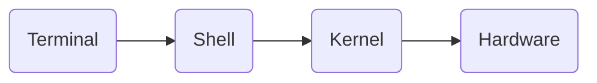

[Voltar para o início](./README.md)

# Command Line 101

## Sumário

1. [Atalhos de teclado](#atalhos-de-teclado)
2. [Comandos de visualização](#comandos-de-visualização)
3. [Comandos de locomoção](#comandos-de-locomoção)
4. [Comandos de criação](#comandos-de-criação)
5. [Comandos de remoção](#comandos-de-remoção)
6. [Metacaracteres](#metacaracteres)
7. [Nano](#nano)
8. [VIM](#vim)

## Adicionando o Git Bash no Windows Terminal

**Adicionar executável**
```
C:\\Program Files\\Git\\bin\\bash.exe
```
<br>

**Adicionar ícone**
```
C:\\Program Files\\Git\\mingw64\\share\\git\\git-for-windows.ico
```
<br>

[Fonte (em inglês)](https://executecommands.com/add-git-bash-to-windows-terminal-app-profile/)

## Entendendo o Command Line



## Sintaxe


## Atalhos de teclado
Limpar tela do terminal
```
ctrl + L
```

## Comandos de visualização
Visualizar o conteúdo do diretório
```bash
$ ls
```
- Azul = diretório
- Branco = arquivo
- Vermelho = arquivo compactado
- Verde Água = link
<br>

Listar diretório anterior
```bash
$ ls ..
```
<br>

Visualizar o diretório nativo sem se deslocar do diretório corrente
```bash
$ ls ~
```
<br>

Listar no formato longo
```bash
$ ls -l
```
<br>

Listar tudo, até arquivos e diretórios ocultos
```bash
$ ls -a
```
<br>

Lista mostrando o que cada informação é
```bash
$ ls -F
```
- arquivos simples = sem símbolo
- diretórios = /
- arquivos linkados = @
<br>

Lista os arquivos e diretórios por ordem de data de modificação
```bash
$ ls -t
```
<br>

Lista os arquivos e diretórios por linha
```bash
$ ls -F
```
<br>

Ler de maneira "Humana"
```bash
$ ls -1
```
<br>

Ler de maneira recursiva:
```bash
$ ls -R
```
<br>

Listar pelo tamanho
```bash
$ ls -S
```
<br>

Visualizar os arquivos e diretórios em árvore
```bash
$ tree
```
<br>

Visualizar apenas os diretórios em árvore
```
$ tree -d
```
<br>

Visualizar o caminho do diretório que se encontra no momento
```bash
$ pwd
```
<br>

Visualizar o conteúdo de um arquivo na tela
```bash
$ cat caminho/arquivo
```
<br>

Visualizar o conteúdo de um arquivo linha por linha
```bash
$ cat caminho/arquivo | more
```
<br>

Visualizar o conteúdo de um arquivo de modo livre (o conteúdo do arquivo não fica printado no terminal)
```bash
$ less caminho/arquivo
```
<br>

Descobrir tipo e informações de um arquivo
```bash
$ file filename
```
<br>

Descobrir dono, modificações e tamanho
```bash
$ stat filename
```
<br>

Encontrar arquivos
```bash
$ find <path> -type f -name "*.png"
```
<br>

Encontrar diretórios
```bash
$ find <path> -type d -name "desenvolvimento"
```

o *parâmetro* `-iname` faz com que ele procure tanto em maiúsculo quanto minúsculo no `find`

## Comandos de locomoção
Vai para o diretório atual
```bash
$ cd .
```
<br>

Vai para o diretório anterior
```bash
$ cd ..
```
<br>

Muda de diretório de acordo com o Caminho
```bash
$ cd /caminho
```
<br>

Muda para o diretório nativo do usuário
```bash
$ cd ~
```
<br>

Muda para o último diretório acessado
```bash
$ cd -
```
<br>

Para mover um arquivo para outro diretório
```bash
$ mv caminho_origem caminho_destinho
```
<br>
  
Para renomear um arquivo ou diretório (*deve-se estar no mesmo diretório do arquivo/diretório que deseja renomear*)
```bash
$ mv file1.txt arquivo1.txt
```
<br>

Mover e renomear um arquivo ou diretório para outro lugar
```bash
$ mv caminho_origem caminho_destinho/novo_nome
```

## Comandos de criação
Criar diretório
```bash
$ mkdir diretorio
```
<br>

Adicionando o *parâmetro* `-p`, você cria vários diretórios de acordo com o caminho
```bash
$ mkdir -p pasta1/pasta2
```
<br>

Para criar vários diretórios de uma só vez, basta adicionar ***espaço*** entre eles
```bash
$ mkdir pasta2 pasta3
```
<br>

Criar arquivos
```bash
$ touch file1.txt
```
<br>

Para criar vários arquivos de uma só vez, basta adicionar ***espaço*** entre eles
```bash
$ touch file2.txt file3.txt
```
PS: *`$ touch` também serve para mudar data/hora de criação de arquivo*
<br>

Copiar arquivos e pastas
```bash
$ cp file1.txt nome_dir
```
<br>

Para copiar mais de um arquivo ou diretório, basta adicionar o *parâmetro* `-r`
```bash
$ cp -r file1.txt file2.txt nome_dir
```
<br>

Informa se deseja sobrescrever um arquivo com o mesmo nome, caso já exista
```bash
$ cp -i
```
<br>

Faz a cópia sobrescrevendo arquivo com o mesmo nome, sem perguntar ao usuário
```bash
$ cp -f
```
<br>

Ao copiar, se existir um arquivo com o mesmo nome no caminho destino, mantém-se o arquivo antigo com “~” no final dele
```bash
$ cp -b
```
<br>

Criar um arquivo link
```bash
$ ln -s nome_arquivo_origem nome_link
```

## Comandos de remoção
Remover o diretório se ele estiver vazio e esteja pelo menos um nível acima
```bash
$ rmdir nome_diretório
```
<br>

Remover os diretórios de acordo com o caminho, respeitando a regra anterior
```bash
$ rmdir -p nome_caminho_diretório
```
<br>

Remove todos os arquivos dentro do diretório e o diretório, de forma recursiva e forçada
```bash
$ rm -rf nome_diretorio
```
<br>

Remover arquivo
```bash
$ rm nome_arquivo_ou_diretório
```
<br>

Remover arquivo com interação do usuário
```bash
$ rm -i nome_arquivo_ou_diretório
```
<br>

Excluir vários arquivos sem interagir com o usuário
```bash
$ rm -rf nome_arquivo
```


## Metacaracteres
- `*` - Representar qualquer quantidade de caracteres
- `?` - Substituir apenar 1 caractere
- `[]` - gerar lista de caracteres (cada colchete substitui 1 caractere na busca)
- `{}` - gerar sequência de caracteres separados por vírgula (avisa se não encontrar, utilizado quando sabe o que está procurando)

## Nano

**Entrar no editor**
```bash
$ nano nome_arquivo
```
<br>

**Atalhos de teclado**

- `ctrl + o` \-> Salvar o arquivo
- `ctrl + x` \-> Sair do editor
<br>

## VIM

**Entrar no editor**  
```bash
$ vi nome_arquivo
```
<br>
  
**Atalhos de teclado**

- `"a" ou "i"` \-> Entrar no modo de inserção
- `"o"` \-> Quebra a linha e ativa o modo de inserção
- `ESC` \-> Sair do modo de escrita
- `:w` \-> Salvar arquivo
- `:wq` \-> Salvar e sair
- `:q!` \-> Sair sem salvar


