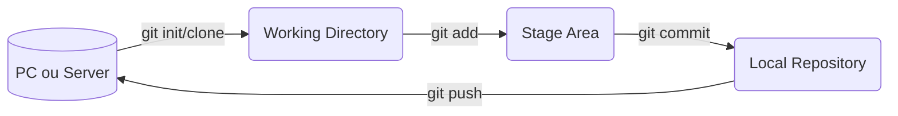
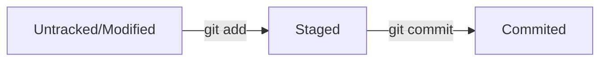

# Git e Github

[Voltar para o início](./README.md)

## Git

+ Sistema de versão distribuído
+ Open source
+ Pontos na história: *commit*
  + Histórico de alterações no código
  + Voltar para qualquer ponto da história
+ Controlar fluxo de novas *features*
  + Ramificações: *branch*
  + Contribuições ao mesmo tempo
  + Análise e resolução de conflitos

## Configuração Inicial

Atividade | Comando
-- | --
Definir nome do usuário | `git config --global user.name 'DiegoCstBraga'`
Definir email do usuário | `git config --global user.email 'diego.cstbraga@gmail.com'`
Alterar o editor padrão para o vscode | `git config --global core.editor 'code -w'`
Visualizar configurações do git | `git config --list`

## Lembretes principais do Git/GitHub

### Ordem comum na execução das tarefas



### Estágios do arquivo



Adicionar repositório local à um repositório remoto

```bash
git remote add origin https://github.com/diegocstbraga/reponame
git branch -M main
git push -u origin main
```

| Atividade | Comando | Info Extra |
--|--|--
Clonar um repositório/projeto | `git clone <url do repo>` |
Conferir o estado das alterações do projeto | `git status` |
Iniciar um repositório local | `git init` |
Adicionar todos os arquivos | `git add .` |
Fazer *commit* | `git commit -m "Mensagem do Commit"` | Mensagem no presente
Adicionar todos os arquivos e fazer um *commit* | `git commit -am "Mensagem do commit"` | Mensagem no presente
Adicionar mudanças remotas para o repo local | `git pull` | `git pull --rebase origin <branch name>`
Adicionar mudanças locais para o repo remoto | `git push origin <branch name>` |
Alterar a *branch* | `git checkout <branch name>` |
Criar uma *branch* | `git branch <branch name>` |
Criar nova *branch* e alterar para ela | `git checkckout -b <branch name>`
Fazer *merge* | `git merge <branch name>` | Voltar para a *branch* original
Remover arquivo do *Stage Area* | `git restore --staged <file>` |
Arrumar o último commit feito|`git commit --amend -m "Nova msg"` | Mensagem no presente
Adicionar alterações de um *branch* específica para a atual | `git pull origin <branch name>` |
Retira as alterações que não foram *commitadas* | `git reset --hard` |
Visualizar os *commits* | `git log` |
Visualizar o log das alterações de maneira curta | `git log --oneline` |

## Vale a pena ressaltar

Adicionar arquivo

```bash
git add fileName.txt
```

Remover arquivo do Stage Area

```bash
git rm --cached <file>
```

Renomear um arquivo

```bash
git mv <file> <newFileName>
```

Restaurar um commit

```bash
git revert HEAD~2
# restaura para o penúltimo commit 
```

> ou

```bash
git revert <sha-1>
```

Pegar um arquivo específico de um commit

```bash
git checkout <sha-1> -- <fileName>
```

Conferir as alterações que foram feitas e estão no untracked area

```bash
git diff
```

Conferir as alterações que foram feitas e estão no stage area

```bash
git diff --staged
``

Gerar um SSH

```bash
ssh-keygen -t rsa -b 4096 -C "diego.cstbraga@gmail.com"
``

Conferir o SSH gerado

```bash
cat ~/.ssh/id_rsa.pub
``

Ativar SSH no **Windows**

```bash
eval `ssh-agent -s`
ssh-add ~/.ssh/id_rsa
``

## Log

Visualizar uma quantidade n de commits

```bash
git log -n 5
``

Visualizar commits a partir de uma data no formato ISO

```bash
git log --since=2020-10-01
``

Visualizar commits antes de uma data no formato ISO

```bash
git log --until=2020-10-01
``

Visualizar commits por autor

```bash
git log --author="Diego"
``

Visualizar commits por palavras específicas

```bash
git log --grep="bugfix"
```
