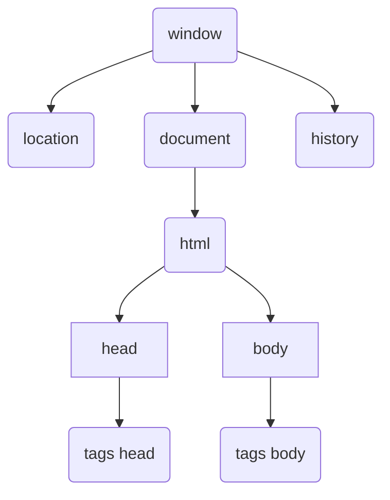

# DOM (Document Object Model)

## Árvore DOM



---

## Selecionando elemento

### Por Marca

```javascript
window.document.getElementsByTagName('p')[0]
//[index] serve para selecionar o elemento específico, começa em 0
// Retorna um HTMLCollection
```

### Por ID

```javascript
window.document.getElementById('textoMateria')
// Retorna um elemento
```

### Por Nome

```javascript
window.document.getElementsByName('nome')[0]
// [index] serve para selecionar o elemento específico, começa em 0
// Retorna um HTMLCollection
```

### Por Classe

```javascript
window.document.getElementsByClassName('materia')[0]
// [index] serve para selecionar o elemento específico, começa em 0, é opcional
// Retorna um HTMLCollection
```

### Por Seletor

```javascript
window.document.querySelector('p#textoMateria')
// Retorna um elemento

window.document.querySelectorAll()
// [index] serve para selecionar o elemento específico, começa em 0, é opcional
// Retorna um nodeList
```

---

## Estilizando via JavaScript

Style

```javascript
// o estilo é como se fosse inline style
document.getElementById("p2").style.color = "blue";
```

ClassList

```javascript
element.classList.add('darkMode')
element.classList.remove('darkMode')
element.classList.toggle('darkMode')
```

---

## Eventos DOM

```javascript
let  idArea = document.getElementById('area')
{/* <div id="area" onmousedown="trocarBackground()" 
onmouseout='voltarBackground()'>
Interaja...
</div> */}

// PARA DEIXAR A DIV MAIS ORGANIZADA, VALE A PENA USAR EVENT LISTENER
// EVENTO DO MOUSE AO PRESSIONAR O ELEMENTO
idArea.addEventListener('mousedown', trocarBackground())

// EVENTO DO MOUSE AO SAIR DO ELEMENTO
idArea.addEventListener('mouseout', voltarBackground())
```

Para saber todos os eventos, clique [aqui](https://developer.mozilla.org/pt-BR/docs/Web/Events)

## Adicionando elementos à DOM

```javascript
let elemResField = document.querySelector('#resField')

let img = document.createElement('img')

img.src = "https://images.unsplash.com/photo-1571243863567-fb012e468631?ixid=MnwxMjA3fDB8MHxwaG90by1wYWdlfHx8fGVufDB8fHx8&ixlib=rb-1.2.1&auto=format&fit=crop&w=675&q=80"

elemResField.appendChild(img)
```

Objetivo|Código
-|-
Adicionar elemento|`elemResField.append(img)`
Adicionar elemento como primeiro filho|`elemResField.prepend(img)`
Adicionar antes de um elemento|`elemResField.insertBefore(divAdd, divReferencia)`

## Adicionar elementos ao HTML

```javascript
document.write(`Linha adicionada via javascript<br/>`)
// É POSSÍVEL ADICIONAR TAGS HTML

document.write(`<h2>Escrevi um Cabeçalho de nível 2</h2>`
```

## Removendo elementos da DOM

```javascript
// PRECISA QUE O ELEMENTO EM QUESTÃO JÁ EXISTA PARA REMOVÊ-LO
resField.removeChild(document.querySelector('#resField p'))

// ZERA O ELEMENTO, DIV OU CLASSE
resField.innerHTML  =  ``
```

## Manipular Conteúdo

```js
// considere as constantes abaixo para a tabela
const elementList = document.querySelector('#lista')
const elementLogin = document.querySelector('#login')
const elementHeader = document.querySelector('header')
```

Objetivo|Código
-|-
Manipular conteúdo do texto|`elementList.textContent = 'Olá lista'`
Manipular texto|`elementList.innerText = 'Olá lista'`
Manipular HTML|`elementList.innerHTML = '<h1>Olá lista</h1>'`
Manipular valor|`elementLogin.value = 'Valor desejado'`
Manipular atributo|`elementHeader.setAttribute('id', 'cabecalho')`
Pegar atributo|`elementHeader.getAttribute('id')`
Remover atributo|`elementHeader.removeAttribute('id')`

## Navegar pelos elementos

```js
// considere as constantes abaixo para a tabela
const body = document.querySelector('body')
const header = document.querySelector('header')
```

Objetivo|Código|Comentários
-|-|-
Buscar elemento pai|`body.parentNode`|
Buscar elemento pai|`body.parentElement`|
Buscar elementos filho|`body.childNodes`|Considera os espaços vazios
Buscar elementos filho|`body.children`|Desconsidera os espaços vazios
Buscar primeiro filho|`body.firstElementChild`|Desconsidera os espaços vazios
Buscar primeiro filho|`body.firstChild`|Considera os espaços vazios
Buscar último filho|`body.lastElementChild`|Desconsidera os espaços vazios
Buscar último filho|`body.lastChild`|Considera os espaços vazios
Buscar próximo irmão|`header.nextSibling`|Considera os espaços vazios
Buscar próximo irmão|`header.nextElementSibling`|Desconsidera os espaços vazios
Buscar irmão anterior|`header.previousSibling`|Considera os espaços vazios
Buscar irmão anterior|`header.previousElementSibling`|Desconsidera os espaços vazios
