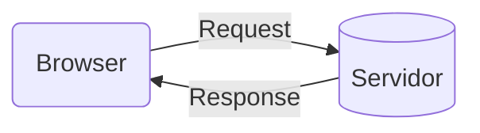

# Desenvolvimento Web

[Voltar para o início](./README.md)

## Sumário

- [Desenvolvimento Web](#desenvolvimento-web)
  - [Sumário](#sumário)
  - [Como funciona a web](#como-funciona-a-web)
  - [HTTP](#http)
    - [Pedido (request)](#pedido-request)
    - [Response (resposta)](#response-resposta)
    - [Request/Response](#requestresponse)
    - [Exemplos de Request e Response](#exemplos-de-request-e-response)
      - [REQUEST MESSAGE](#request-message)
      - [RESPONSE MESSAGE](#response-message)
  - [HTML](#html)
    - [Web Semântica](#web-semântica)
      - [Citações no HTML](#citações-no-html)
      - [Sessões comuns no HTML](#sessões-comuns-no-html)
      - [Listas no HTML](#listas-no-html)
      - [Descrições no HTML](#descrições-no-html)
      - [Publicações e tópicos no HTML](#publicações-e-tópicos-no-html)
    - [Elementos para uso genérico](#elementos-para-uso-genérico)
    - [Formulário no HTML](#formulário-no-html)
      - [Form](#form)
      - [Atributos Form](#atributos-form)
      - [Atributos Fieldset](#atributos-fieldset)
      - [Atributos Label](#atributos-label)
      - [Atributos Button](#atributos-button)
    - [Input](#input)
      - [Atributos Input](#atributos-input)
      - [Atributos Input type password](#atributos-input-type-password)
      - [Atributos Input type email](#atributos-input-type-email)
      - [Atributos Input type url](#atributos-input-type-url)
      - [Atributos Input type file](#atributos-input-type-file)
      - [Atributos Input type color](#atributos-input-type-color)
      - [Atributos Input type checkbox](#atributos-input-type-checkbox)
      - [Atributos Input type radio](#atributos-input-type-radio)
      - [Atributos Input type search](#atributos-input-type-search)
      - [Atributos Input type number](#atributos-input-type-number)
      - [Atributos Input type range](#atributos-input-type-range)
      - [Atributos Input type hidden](#atributos-input-type-hidden)
    - [Textarea](#textarea)
      - [Atributos Textarea](#atributos-textarea)
    - [Select](#select)
      - [Atributos Select](#atributos-select)
    - [Optgroup](#optgroup)
    - [Usando mídia no HTML](#usando-mídia-no-html)
      - [Vídeo](#vídeo)
      - [Áudio](#áudio)
      - [Iframe](#iframe)
      - [Imagens](#imagens)
      - [SVG](#svg)
  - [CSS](#css)
    - [A cascata de estilização](#a-cascata-de-estilização)
    - [Priorização do estilo](#priorização-do-estilo)
    - [Especificidade](#especificidade)
    - [A regra !important](#a-regra-important)
    - [At-rules (@)](#at-rules-)
      - [Identificadores](#identificadores)
    - [Shorthand](#shorthand)
    - [Vendor Prefixes](#vendor-prefixes)
    - [Font-properties](#font-properties)
    - [Unidades de medida no CSS](#unidades-de-medida-no-css)
      - [Unidades comuns](#unidades-comuns)
      - [Distâncias absolutas](#distâncias-absolutas)
      - [Distâncias Relativas](#distâncias-relativas)
    - [Selectors e Combinators](#selectors-e-combinators)
      - [Seletor de Atributo](#seletor-de-atributo)
    - [Seletor de vários elementos](#seletor-de-vários-elementos)
      - [Combinators](#combinators)
      - [Pseudo-classes](#pseudo-classes)
      - [Pseudo-elements](#pseudo-elements)
    - [Box Model](#box-model)
      - [box-sizing](#box-sizing)
      - [display](#display)
    - [Cores](#cores)
      - [Tipos](#tipos)
      - [Valores](#valores)
    - [Background](#background)
    - [Page Layouts](#page-layouts)
      - [Grid](#grid)
        - [Sintaxe CSS do Grid](#sintaxe-css-do-grid)
      - [Flexbox](#flexbox)
        - [flex-direction](#flex-direction)
        - [justify-content](#justify-content)
        - [align-items](#align-items)
        - [align-self](#align-self)
        - [flex-wrap](#flex-wrap)
        - [flex-flow](#flex-flow)
        - [align-content](#align-content)
      - [Propriedades dos itens](#propriedades-dos-itens)
        - [flex shorthand](#flex-shorthand)

## Como funciona a web

## HTTP

HTTP = Hypertext Transfer Protocol



---

### Pedido (request)

| Methods | Meaning          |
| ------- | ---------------- |
| GET     | Pegar um recurso |
| POST    | Criar um recurso |

### Response (resposta)

| Status Code | Meaning                  |
| ----------- | ------------------------ |
| 200         | OK                       |
| 301         | Redirecionamento         |
| 404         | Recurso não encontrado   |
| 500         | Erro interno de servidor |

### Request/Response

- Header
  - Campos informativos
  - Propriedade: Valor
- Body
  - HTML
  - Conteúdo
  - JSON

---

### Exemplos de Request e Response

#### REQUEST MESSAGE

```txt
GET /index.html HTTP/1.1
User-Agent: Mozilla/4.0
Accept: text/html
```

#### RESPONSE MESSAGE

```txt
HTTP/1.1 200 OK
Server: express
Content-Type: text/html
```

## HTML

### Web Semântica

- Importante para a acessibilidade do usuário
- Motores de buscas priorizam sites semânticos

#### Citações no HTML

| Objetivo          | Tag                         | Comentários |
| ----------------- | --------------------------- | ----------- |
| Espaço de citação | `<blockquote></blockquote>` |
| Autor da citação  | `<cite></cite>`             |

#### Sessões comuns no HTML

| Objetivo           | Tag                 | Comentários                                                                                             |
| ------------------ | ------------------- | ------------------------------------------------------------------------------------------------------- |
| Cabeçalho          | `<header></header>` | Se utilizado no início da página, é visto como global; Pode ser usado dentro de um article, section etc |
| Barra de navegação | `<nav></nav>`       | pode ser usado dentro de articles ou globalmente                                                        |
| Conteúdo principal | `<main></main>`     | Conteúdo principal do site                                                                              |
| Barra lateral      | `<aside></aside>`   | Conteúdos que possuem relação com o conteúdo principal                                                  |
| Rodapé             | `<footer></footer>` | Normalmente no final da página                                                                          |

#### Listas no HTML

| Objetivo                   | Tag         | Comentários                               |
| -------------------------- | ----------- | ----------------------------------------- |
| Definir lista ordenada     | `<ol></ol>` |
| Definir lista não ordenada | `<ul></ul>` |
| Definir item à lista       | `<li></li>` | Deve ficar dentro da tag `<ol>` ou `<ul>` |

#### Descrições no HTML

| Objetivo                  | Tag         | Comentários |
| ------------------------- | ----------- | ----------- |
| Description List          | `<dl></dl>` |
| Description Title ou Term | `<dt></dt>` |
| Description Data          | `<dd></dd>` |

#### Publicações e tópicos no HTML

| Objetivo            | Tag                         | Comentários                                                                    |
| ------------------- | --------------------------- | ------------------------------------------------------------------------------ |
| Artigo              | `<article></article>`       | Focado para conteúdos "genéricos", como publicações, receitas etc              |
| Sessão              | `<section></section>`       | Geralmente acompanha de um título e depois um conteúdo                         |
| Imagem              | `<figure></figure>`         | Usar figura por volta de uma figura, caso precise colocar autor, descrição etc |
| Descrição da imagem | `<figcaption></figcaption>` |

### Elementos para uso genérico

- Usar esses casos apenas caso não ache um motivo semântico para parte do código/layout
- Acompanhar esses elementos com alguma Class ou Id, para gerar maior significado

| Objetivo            | Tag             | Comentários |
| ------------------- | --------------- | ----------- |
| Bloco não semântico | `<div></div>`   |
| Texto não semântico | `<span></span>` |

### Formulário no HTML

#### Form

```html
<form action="" method="">
  <fieldset>
    <legend>Contato</legend>
  </fieldset>

  <label for="nome">Nome Completo</label>
  <input id='nome' type='text'/>
  <input type="text" list="fruitsdata" placeholder="Escolha uma fruta"/>

  <datalist id="fruitsdata">
    <option>apple</option>
    <option>pineapple</option>
    <option>banana</option>
  <datalist>

  <button>Enviar</button>
</form>
```

#### Atributos Form

| Objetivo                                         | Atributo    | Comentários e Valores |
| ------------------------------------------------ | ----------- | --------------------- |
| Definir um caminho que será redirecionado o form | `action=''` |
| Definir o método GET ou POST                     | `method=""` |

#### Atributos Fieldset

| Objetivo                                     | Atributo        | Comentários e Valores |
| -------------------------------------------- | --------------- | --------------------- |
| Desabilitar os campos de inserção            | `disabled`      |
| Definir o fieldset à um formulário           | `form="idForm"` |
| Atribuir um nome para identificar o fieldset | `name=""`       |

#### Atributos Label

| Objetivo                            | Atributo        | Comentários e Valores |
| ----------------------------------- | --------------- | --------------------- |
| Conectar a label com a tag de input | `for="idInput"` |

#### Atributos Button

| Objetivo                                 | Atributo        | Comentários e Valores                                                 |
| ---------------------------------------- | --------------- | --------------------------------------------------------------------- |
| Definir o tipo de botão                  | `type=""`       | reset, submit, button                                                 |
| Focar automaticamente o botão            | `autofocus`     |
| Desabilitar o botão                      | `disabled`      | útil deixar desabilitado enquanto o formulário não estiver preenchido |
| Identificar o botão por um nome          | `name=""`       |
| Receber um valor de um botão             | `value=""`      |
| Conectar o botão com o form identificado | `form="idForm"` |

### Input

#### Atributos Input

| Objetivo                               | Atributo                     | Comentários e Valores                          |
| -------------------------------------- | ---------------------------- | ---------------------------------------------- |
| Definir tipo de input                  | `type=""`                    | data,text,color,number,email,file,password,... |
| Sugerir completar info automaticamente | `autocomplete=""`            | email,data,username,...                        |
| Focar automaticamente                  | `autofocus`                  |
| Desabilitar input                      | `disabled`                   |
| Definir um valor inicial               | `value="valor pré definido"` |
| Definir texto exemplo                  | `placeholder="seu exemplo"`  |
| Ler apenas o input                     | `readonly`                   |
| Linkar input com algum form            | `form="idForm"`              |
| Definir nome do input                  | `name=""`                    |
| Definir que input é necessário         | `required`                   |

#### Atributos Input type password

| Objetivo                               | Atributo                              | Comentários e Valores |
| -------------------------------------- | ------------------------------------- | --------------------- |
| Definir tamanho mínimo da senha        | `minlength=""`                        |
| Definir tamanho máximo da senha        | `maxlength=""`                        |
| Tamanho do campo                       | `size=""`                             |
| Definir expressão Regulares            | `pattern=""`                          | Regex                 |
| Definir info caso dê errado o input    | `title="Ensira a senha de maneira X"` |
| Definir tipo de input                  | `inputmode=""`                        | numeric...            |
| Sugerir completar info automaticamente | `autocomplete=""`                     | on, off, new-password |

#### Atributos Input type email

| Objetivo                                         | Atributo                              | Comentários e Valores |
| ------------------------------------------------ | ------------------------------------- | --------------------- |
| Permitir 1 ou mais emails separados por vírgulas | `multiple`                            |
| Definir tamanho mínimo do email                  | `minlength=""`                        |
| Definir tamanho máximo do email                  | `maxlength=""`                        |
| Tamanho do campo                                 | `size=""`                             |
| Definir expressão Regulares                      | `pattern=""`                          | Regex                 |
| Definir info caso dê errado o input              | `title="Ensira o email de maneira X"` |
| Pegar sugestões de email de um datalist          | `list="idDatalist"`                   |

#### Atributos Input type url

| Objetivo                              | Atributo                              | Comentários e Valores |
| ------------------------------------- | ------------------------------------- | --------------------- |
| Definir tamanho mínimo do url         | `minlength=""`                        |
| Definir tamanho máximo do url         | `maxlength=""`                        |
| Tamanho do campo                      | `size=""`                             |
| Definir expressão Regulares           | `pattern=""`                          | Regex                 |
| Definir info caso dê errado o input   | `title="Ensira o email de maneira X"` |
| Pegar sugestões de url de um datalist | `list="idDatalist"`                   |
| Habilitar verificação ortográfica     | `spellcheck=""`                       | true,false            |

#### Atributos Input type file

Sintaxe

```html
<form
  action=""
  method="post"
  enctype="multipart/form-data"
>
  <input type="file" />
</form>
```

| Objetivo                                      | Atributo    | Comentários e Valores        |
| --------------------------------------------- | ----------- | ---------------------------- |
| Definir os tipos de arquivos a serem enviados | `accept=""` | .doc,audio/\*,.imagem/\*,... |
| Permitir envio de vários arquivos             | `multiple`  |
| Lista de arquivo ou arquivos                  | `files=""`  |
| Valor do arquivo a ser enviado                | `value=""`  |

#### Atributos Input type color

| Objetivo               | Atributo            | Comentários e Valores |
| ---------------------- | ------------------- | --------------------- |
| Definir cor padrão     | `value=""`          | RGB                   |
| Definir lista de cores | `list="idDatalist"` |

#### Atributos Input type checkbox

| Objetivo                             | Atributo   | Comentários e Valores |
| ------------------------------------ | ---------- | --------------------- |
| Deixar o campo marcado como padrão   | `checked`  |
| Atribuir um nome ao tipo de checkbox | `name=""`  |
| Atribuir um valor ao checkbox        | `value=""` |

#### Atributos Input type radio

| Objetivo                             | Atributo   | Comentários e Valores |
| ------------------------------------ | ---------- | --------------------- |
| Deixar o campo marcado como padrão   | `checked`  |
| Atribuir um nome ao tipo de checkbox | `name=""`  |
| Atribuir um valor ao checkbox        | `value=""` |

#### Atributos Input type search

| Objetivo                               | Atributo        | Comentários e Valores |
| -------------------------------------- | --------------- | --------------------- |
| Definir lista de algo a ser pesquisado | `list=""`       |
| Definir uso de REGEX                   | `pattern=""`    |
| Usar label dentro do input             | `aria-label=""` |

#### Atributos Input type number

| Objetivo                                    | Atributo   | Comentários e Valores |
| ------------------------------------------- | ---------- | --------------------- |
| Definir valor mínimo                        | `max=100`  |
| Definir valor máximo                        | `max=100`  |
| Definir procedência de um número para outro | `step="5"` |

#### Atributos Input type range

| Objetivo                                    | Atributo   | Comentários e Valores |
| ------------------------------------------- | ---------- | --------------------- |
| Definir valor mínimo                        | `max=100`  |
| Definir valor máximo                        | `max=100`  |
| Definir procedência de um número para outro | `step="5"` |

#### Atributos Input type hidden

Útil em situações que serão dados enviados "automaticamente", como IP do user, horário de envio do form etc

| Objetivo          | Atributo   | Comentários e Valores |
| ----------------- | ---------- | --------------------- |
| Atribuir um valor | `value=""` |

### Textarea

```html
<textarea></textarea>
```

#### Atributos Textarea

| Objetivo                           | Atributo       | Comentários e Valores |
| ---------------------------------- | -------------- | --------------------- |
| Definir quantidade de linhas       | `rows=""`      |
| Definir quantidade de colunas      | `cols=""`      |
| Definir tamanho mínimo do textarea | `minlength=""` |
| Definir tamanho máximo do textarea | `maxlength=""` |
| Embrulhar o texto                  | `wrap=""`      | soft,hard,off         |

### Select

```html
<select name="carmodel">
  <option value="audi">A3</option>
</select>
```

#### Atributos Select

| Objetivo                              | Atributo   | Comentários e Valores |
| ------------------------------------- | ---------- | --------------------- |
| Permitir 1 ou mais itens selecionados | `multiple` |
| Tamanho do campo                      | `size=""`  |

### Optgroup

```html
<select name="animais">
  <optgroup label="Sudeste">
    <option value="Sao Paulo">São Paulo</option>
    <option value="Rio de Janeiro">Rio de Janeiro</option>
  </optgroup>
  <optgroup label="Sul">
    <option value="Rio grande do Sul">Rio grande do Sul</option>
    <option value="Paraná">Paraná</option>
  </optgroup>
</select>
```

### Usando mídia no HTML

#### Vídeo

Sintaxe

```html
<video
  src="./assets/video.mp4"
  controls
>
  <p>Este browser não suporta vídeo, baixe-o aqui</p>
</video>

<!-- Usar a tag source para adicionar mais de uma fonte de áudio -->
<video controls>
  <source
    src="./assets/video.mp4"
    type="video/mp4"
  />
  <source
    src="./assets/video2.mp4"
    type="video/mp4"
  />
  <p>Este browser não suporta vídeo, baixe-o aqui</p>
</video>
```

Atributos

| Objetivo                             | Atributo                | Comentários          |
| ------------------------------------ | ----------------------- | -------------------- |
| Origem do arquivo de vídeo           | `src=""`                |
| Definir controles ao player de vídeo | `controls`              |
| Largura do Player                    | `width="200"`           |
| Altura do Player                     | `heigth="200"`          |
| Rodar automaticamente o vídeo        | `autoplay`              |
| Carregar o vídeo antes de dar play   | `preload="auto"`        | auto, metadata, none |
| Vídeo em loop                        | `loop`                  |
| Iniciar sem som                      | `muted`                 |
| Thumbnail do vídeo                   | `poster="./imagem.png"` |

[Informações adicionais sobre mídia](https://developer.mozilla.org/pt-BR/docs/Web/Media/Formats)

---

#### Áudio

Sintaxe

```html
<audio
  src="./assets/video.mp4"
  controls
>
  <p>Este browser não suporta áudio, baixe-o aqui</p>
</audio>

<!-- Usar a tag source para adicionar mais de uma fonte de áudio -->
<audio controls>
  <source
    src="./assets/audio.mp3"
    type="audio/mp3"
  />
  <source
    src="./assets/audio2.mp3"
    type="audio/mp3"
  />
  <p>Este browser não suporta áudio, baixe-o aqui</p>
</audio>
```

Atributos

| Objetivo                             | Atributo         | Comentários          |
| ------------------------------------ | ---------------- | -------------------- |
| Origem do arquivo de vídeo           | `src=""`         |
| Definir controles ao player de vídeo | `controls`       |
| Rodar automaticamente o vídeo        | `autoplay`       |
| Carregar o áudio antes de dar play   | `preload="auto"` | auto, metadata, none |
| Vídeo em loop                        | `loop`           |
| Iniciar sem som                      | `muted`          |

---

#### Iframe

- Funciona com vídeos do youtube, mapas do google maps e etc

Sintaxe

```html
<iframe
  width="560"
  height="315"
  src="https://www.youtube-nocookie.com/embed/dQw4w9WgXcQ"
  title="YouTube video player"
  frameborder="0"
  allow="accelerometer; autoplay; clipboard-write; 
 encrypted-media; gyroscope; picture-in-picture"
  allowfullscreen
>
</iframe>
```

Atributos

| Objetivo                                                    | Atributo          | Comentários |
| ----------------------------------------------------------- | ----------------- | ----------- |
| Origem do arquivo de vídeo                                  | `src=""`          |
| Definir uma borda no player                                 | `frameborder`     |
| Título do player                                            | `title=""`        |
| Largura do Player                                           | `width="200"`     |
| Altura do Player                                            | `heigth="200"`    |
| Permitir tela cheia                                         | `allowfullscreen` |
| Permitir ferramentas do site que está sendo buscado o vídeo | `allow`           |

[Informações adicionais sobre Iframe](https://developer.mozilla.org/pt-BR/docs/Web/HTML/Element/iframe)

---

#### Imagens

Sintaxe

```html

```

Atributos

| Objetivo                                                       | Atributo    | Comentários |
| -------------------------------------------------------------- | ----------- | ----------- |
| Origem do arquivo                                              | `src=""`    |
| Substituir a imagem caso ela não carregue                      | `alt=""`    |
| Texto que será apresentado ao deixar o mouse em cima da imagem | `title=""`  |
| Definir largura                                                | `width=""`  |
| Definir altura                                                 | `heigth=""` |

---

#### SVG

Sintaxe

```html
<svg
  heigth="400"
  width="400"
></svg>
```

Atributos

| Objetivo        | Atributo    | Comentários |
| --------------- | ----------- | ----------- |
| Definir largura | `width=""`  |
| Definir altura  | `heigth=""` |

## CSS

### A cascata de estilização

> O estilo é sempre lido de cima para baixo

Considera-se os 3 fatores a seguir

1. Priorização do estilo
2. Especificidade
3. Importância

---

### Priorização do estilo

inline > tag style > tag link

---

### Especificidade

É um cálculo matemático, onde, cada tipo de seletor e origem do estilo, possuem valores a serem considerados.

- Força 0 -> Universal selector(\*), combinator e negation pseudo-class(:not())
- Força 1 -> Element type selector(h1) e pseudo-elements (::before, ::after)
- Força 10 -> Classes(.) e attribute selectors ([type='radio'])
- Força 100 -> ID selector (#)
- 1000 -> Inline style

---

### A regra !important

- deve evitar seu uso
- não é considerado uma boa prática
- ignora a regra de priorização de estilo

### At-rules (@)

- Definem o comportamento do CSS
- Inicia com o sinal de '@', seguido de um identificados

#### Identificadores

- @import - Adiciona um CSS Externo
- @media - Regras condicionais de acordo com o dispositivo
- @font-face - Fontes externas
- @keyframes - Animações

```css
@import url('http://local.com/style.css') @media (min-width: 500px) {
  font-size: 0.8rem;
}
```

### Shorthand

- Junta propriedades em uma só linha
- Resumido
- Melhora na legibilidade

```css
/* Sem shorthand */
background-color: #000;
backgroud-image: url(images/bg.gif);

/* Com shorthand */
background: #000 url(images/bg.gif);
```

### Vendor Prefixes

Permite que browsers adicionem "Features", a fim de colocar em uso alguma novidade que vemos no CSS

- -webkit- => Chrome, Safari, IOS e Android
- -moz- => Mozilla (Firefox)
- -ms- => Internet Explorer
- -o- => Opera

[Site para conferir as Features suportadas pelos browsers](https://caniuse.com/)

### Font-properties


| Ação                             | Código                                     | Comentários ou Atributos                     |
| -------------------------------- | ------------------------------------------ | -------------------------------------------- |
| Definir tipo de fonte            | `font-family:Times, serif`                 | Especificar o nome da fonte                  |
| Definir "força" da fonte         | `font-weight:bold`                         | valores numéricos ou string                  |
| Definir estilo da fonte          | `font-style: italic`                       | italic, oblique, normal                      |
| Definir tamanho da fonte         | `font-size: 12px`                          |
| Definir espaços entre caracteres | `letter-spacing: 4px`                      |
| Definir espaços entre palavras   | `word-spacing: 4px`                        |
| Definir espaços entre linhas     | `line-height: 1.5`                         |
| Transformar o texto              | `text-transform: uppercase`                |
| Decorar o texto                  | `text-decoration: line-through dashed red` |
| Alinhar o texto                  | `text-align: center`                       |
| Aplicar sombra no texto          | `text-shadow: 1px 1px 1px black`           | offset-x \| offset-y \| blur-radius \| color |

```css
/* Font shorthand */
/* style variant weigth stretch size line-height family */
/* size/line-height */
font: italic bold 2em/2 Helvetica, Arial;
```

### Unidades de medida no CSS

#### Unidades comuns

| Tipo                   | Exemplos              |
| ---------------------- | --------------------- |
| length (distância)     | `px, em, rem, vw, vh` |
| angle (ângulo)         | `deg, rad, turn`      |
| time (tempo)           | `s, ms`               |
| resolution (resolução) | `dpi`                 |

#### Distâncias absolutas

> Utilizar px como preferência

| Unidade | Nome        | Comentários |
| ------- | ----------- | ----------- |
| `cm`    | Centímetros |
| `in`    | Polegadas   |
| `px`    | Pixels      |

#### Distâncias Relativas

> Maior adaptação aos diferentes tipos de tela

| Unidade | Relativo à                                   | Comentários |
| ------- | -------------------------------------------- | ----------- |
| `em`    | Tamanho da font do pai                       |
| `rem`   | Tamanho da font do elemento raiz (root/html) |
| `vw`    | 1% da viewport width (largura)               |
| `vh`    | 1% da viewport height (altura)               |
| `%`     | Valor do pai                                 |

### Selectors e Combinators

#### Seletor de Atributo

```css
[atributeName] {
  color: orange;
}
```

### Seletor de vários elementos

```css
[atributeName],
h1,
.text,
#nav-bar {
  color: orange;
}
```

#### Combinators

| Combinator                  | Sintaxe           | Comentários                                                                   |
| --------------------------- | ----------------- | ----------------------------------------------------------------------------- |
| Descendant Combinator       | `body article h2` | Busca um elemento dentro de outro                                             |
| Child Combinator            | `body > ul > li`  | Seleciona somente o elemento que é filho direto do pai                        |
| Adjacent Sibling Combinator | `h1 + p`          | Seleciona somente o elemento do lado direito que é irmão direto na hierarquia |
| General Sibling Combinator  | `h1 ~ p`          | Seleciona todos os elementos irmãos                                           |

#### Pseudo-classes

É um tipo de selector que irá selecionar um elemento que estiver em um estado específico.

Pseudo-classes começam com 2 pontos seguido do nome da pseudo class `:pseudo-class-name`

| Pseudo-classes             | Sintaxe                      | Comentários                       |
| -------------------------- | ---------------------------- | --------------------------------- |
| Primeiro filho             | `:first-child`               |
| Enésimo filho              | `:nth-child(2)`              | Pode preencher com _odd_ e _even_ |
| Enésimo elemento           | `article p:nth-of-type(2){}` |
| Mouse por cima do elemento | `:hover`                     |
| Ao receber foco            | `:focus`                     |
| Quando desabilitado        | `:disabled`                  |
| Quando obrigatório         | `:required`                  |

[Mais informações sobre Pseudo-classes](https://developer.mozilla.org/pt-BR/docs/Web/CSS/Pseudo-classes)

#### Pseudo-elements

| Pseudo-elements                        | Sintaxe        | Comentários |
| -------------------------------------- | -------------- | ----------- |
| Aparecer antes do conteúdo             | `::before`     |
| Aparecer depois do conteúdo            | `::after`      |
| Aparecer na primeira linha do elemento | `::first-line` |

[Mais informações sobre Pseudo-elements](https://developer.mozilla.org/pt-BR/docs/Web/CSS/Pseudo-elements)

### Box Model

- Fundamental para fazer layout para a web
- Maior facilidade para aplicar o CSS

Propriedades de um Box Model


#### box-sizing

| content-box                                                                                                  | border-box                                                                                                               |
| ------------------------------------------------------------------------------------------------------------ | ------------------------------------------------------------------------------------------------------------------------ |
| O tamanho da "caixa" é baseada a partir do elemento, não respeitando a largura e a altura definida no código | O tamanho da "caixa" é feito a partir das proporções definidas, respeitando sempre seu tamanho, independente do conteúdo |

#### display

| block                                                         | inline                                                  |
| ------------------------------------------------------------- | ------------------------------------------------------- |
| Ocupa toda a linha, colocando o próximo elemento abaixo desse | Elemento ao lado do outro                               |
| width e height são respeitado                                 | width e height não funcionam                            |
| padding, margin, border irão funcionar normalmente            | somente valores horizontais de margin, padding e border |

### Cores

#### Tipos

- background-color (para caixas)
- color (para textos)
- border-color (para caixas)

#### Valores

- palavra-chave (blue, red, transparent)
- hexadecimal (#990011)
- funções: rgb(), rgba(), hsl(), hsla()

[Mais informações sobre cores](https://developer.mozilla.org/pt-BR/docs/Web/CSS/color_value)

### Background

[Mais informações sobre Background](https://developer.mozilla.org/en-US/docs/Web/CSS/background)

### Page Layouts

#### Grid

- Posicionamento dos elementos dentro da caixa
- Posicionamento horizontal e vertical ao mesmo temo
- Pode ser flexível ou fixo
- Cria espaços para os elementos filhos habitarem

##### Sintaxe CSS do Grid

| Ação                                     | Comando                                                             | Comentários                      |
| ---------------------------------------- | ------------------------------------------------------------------- | -------------------------------- |
| Definir as áreas do grid no elemento pai | `grid-template-areas: "header header" "main aside" "footer footer"` | Cada \"aspas\" é uma linha (row) |
| Atribuir elemento filho ao grid          | `grid-area: header`                                                 |
| Definir tamanho da linha de um grid      | `grid-template-rows: 40px 1fr 40px`                                 |
| Definir tamanho da coluna de um grid     | `grid-template-columns: 2fr 1fr`                                    |

#### Flexbox

- Permite posicionar os elementos dentro da caixa
- Controle em uma dimensão (horizontal ou vertical)
- Alinhamento, direcionamento, ordenar e tamanhos

##### flex-direction

| Direção do conteúdo   | Atributo                          | Comment      |
| --------------------- | --------------------------------- | ------------ |
| Esquerda para direita | `flex-direction: row;`            | valor padrão |
| Cima para baixo       | `flex-direction: column;`         |
| Direita para esquerda | `flex-direction: row-reverse;`    |
| Baixo para cima       | `flex-direction: column-reverse;` |

##### justify-content

- Baseia-se no eixo principal do flexbox

| Alinhar o conteúdo                                         | Atributo                          | Comment      |
| ---------------------------------------------------------- | --------------------------------- | ------------ |
| Para o começo do container                                 | `justify-content: flex-start;`    | valor padrão |
| Para o fim do container                                    | `justify-content: flex-end;`      |
| Para o centro do container                                 | `justify-content: center;`        |
| Com espaço entre os itens, encostando na borda             | `justify-content: space-between;` |
| Com espaço igual entre os itens, mas diferente com a borda | `justify-content: space-around;`  |
| Com espaço igual entre os itens e a borda                  | `justify-content: space-evenly;`  |

##### align-items

- Baseia-se no eixo oposto do flexbox

| Alinhar o conteúdo                              | Atributo                   | Comment      |
| ----------------------------------------------- | -------------------------- | ------------ |
| Para o começo do container                      | `align-items: flex-start;` | valor padrão |
| Para o fim do container                         | `align-items: flex-end;`   |
| Para o centro do container                      | `align-items: center;`     |
| Centralizando os itens no começo do container   | `align-items: baseline;`   |
| Esticando os itens para o conteúdo do container | `align-items: stretch;`    |

##### align-self

- Ajustar o alinhamento de um único elemento

| Alinhar o conteúdo                              | Atributo                  | Comment      |
| ----------------------------------------------- | ------------------------- | ------------ |
| Para o começo do container                      | `align-self: flex-start;` | valor padrão |
| Para o fim do container                         | `align-self: flex-end;`   |
| Para o centro do container                      | `align-self: center;`     |
| Centralizando os itens no começo do container   | `align-self: baseline;`   |
| Esticando os itens para o conteúdo do container | `align-self: stretch;`    |

##### flex-wrap

- Alterar a quantidade de linhas que o conteúdo será apresentado

| Manter os itens do conteúdo                  | Atributo                   | Comment      |
| -------------------------------------------- | -------------------------- | ------------ |
| Na mesma linha                               | `flex-wrap: nowrap;`       | valor padrão |
| Em outras linhas                             | `flex-wrap: wrap;`         |
| Em outras linhas só que no sentido contrário | `flex-wrap: wrap-reverse;` |

##### flex-flow

- Shorthand para o uso de `flex-direction` e `flex-flow`

##### align-content

- Usado para alinhar itens em múltiplas linhas do eixo oposto do flex-container
- Não terá efeito em conteúdo com uma linha

| Alinhar o conteúdo                               | Atributo                        | Comment      |
| ------------------------------------------------ | ------------------------------- | ------------ |
| Para o começo do container                       | `align-content: flex-start;`    | valor padrão |
| Para o fim do container                          | `align-content: flex-end;`      |
| Para o centro do container                       | `align-content: center;`        |
| Com espaço entre os itens, encostando na borda   | `align-content: space-between;` |
| Com espaço entre os itens, sem encostar na borda | `align-content: space-around;`  |
| Esticando os itens para o conteúdo do container  | `align-content: stretch;`       |

#### Propriedades dos itens

- **Sempre** referente ao eixo main do item

| Definir                    | Atributo            | Comment                                                    |
| -------------------------- | ------------------- | ---------------------------------------------------------- |
| Aumentar o tamanho do item | `flex-grow: 1;`     | Proporção, como se fosse o `1fr` do grid                   |
| Encolher o tamanho do item | `flex-shrink: 1`    | Proporção, como se fosse o `1fr` do grid, por padrão vem 1 |
| Largura ou altura          | `flex-basis: 50px;` |

##### flex shorthand

`flex: flex-grow flex-shrink flex-basis`;

[Mais informações sobre Page Layout](https://developer.mozilla.org/pt-BR/docs/Learn/CSS/CSS_layout)

[Mais informações sobre Flexbox](https://www.freecodecamp.org/news/flexbox-the-ultimate-css-flex-cheatsheet/)
