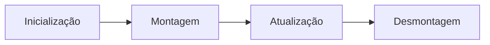

[Voltar para o início](./README.md)

# React 101

## O que é react?
> Uma biblioteca JavaScript para criar interfaces do usuários

- React é uma biblioteca e não um framework
- A principal função é a criação da interface para o usuário
- Linguagem declarativa
- O React está preocupado apenas com o que é exibido na interface
- É baseado em componentes

## Configurando o React
- Renderização de Elementos
	- é renderizado através de como a interface deve estar a cada momento, ao invés de alterá-la com o tempo. Agregando no ganho de performance e evitando erros.
- React DOM
- Nós Raiz

## Componentes e Props
```jsx
import React from 'react'

function Button(props) {
  // props do componente, uma função e um nome
  const {foo, name} = props

  return {
    <button onClick={foo}>{name}</button>
  }
}

export default Button
```

## Estado e ciclo de vida



- Nenhum componente pai ou filho deve saber se outro componente possui estado ou não
- O estado é apenas local ao componente e caso seja necessário enviar algum atributo para outra então é feito via props

## Webpacks
É um empacotador de módulos para aplicações Javascript (**module bundler**)

Gerar bundler que será utilizado no HTML, em ES5

### Conceitos
- Entry point - utilizando grafo, o Webpack precisa de um ponto de entrada para buscar todos os módulos e dependências
- Output - É para determinar quais os bundlers que o Webpack irá emitir
- Loader - Webpack consegue gerenciar arquivos não Javascript
- Plugins - utilizados para otimizar pacotes, minificação, injeção de scripts e mais
- Mode - utilizado para configurar do zero. Possíveis módulos, **production**, **development** ou **none**
	- **Production** trás otimizações internas
	- **Development** trás 3 plugins, UglifyJsPlugin, ModuleConcatenationPlugin e NoEmitOnErrorsPlugin
	- **None** adiciona nenhuma configuração

### Configurando webpack
Adicionar o `package.json` no projeto
```bash
npm init
```
----

Criar arquivo `webpack.config.js`
```bash
touch webpack.config.js
```
---
Instalar as dependências `webpack` e `webpack-cli`, como dependências de desenvolvimento
```bash
npm i -D webpack webpack-cli
```
---
Adicionar na parte de *scripts* do `package.json` o comando abaixo
```bash
"build":"webpack --mode production"
```
---
Adicionar o Babel dentro do projeto
```bash
npm i @babel/core babel-loader @babel/preset-env @babel/preset-react --save-dev
```
---
Adicionar React ao projeto
```bash
npm i react react-dom
```
---
Adicionar preset Babel do React ao projeto
```bash
npm i -D babel-preset-react
```
---
Adicionar as propriedades no arquivo `.babelrc`
```js
{
  "presets": [
    "@babel/preset-env",
    "@babel/preset-react"
  ]
}
```
---
Adicionar na parte de *scripts* do `package.json` o comando abaixo
```bash
"dev" : "webpack --mode development"
```
---
Instalar o `html-webpack-plugin`
```bash
npm i -D html-webpack-plugin
```

---
O arquivo `webpack.config.js` deve ficar aproximadamente desse jeito
```js
const  path = require('path')
const  HtmlWebPackPlugin = require("html-webpack-plugin")

module.exports  = {
    devtool: 'source-map',
    entry: './src/index.js',
    output: {
      path: path.resolve(__dirname, 'dist'),
      filename: 'bundler.js'
    },
    module: {
      rules: [
        {
          test:  /\.(js|jsx)$/,
          exclude: /node_modules/,
          use: {
            loader:  "babel-loader"
          }
        }
      ]
    },
  plugins: [
    new HtmlWebPackPlugin({
      template : './src/index.html',
      filename : '.index.html'
    })
  ]
}
```
---
Rodar o script
```bash
npm run dev
```
```bash
npm run build
```
---
Criar um Dev Server
```bash
npm i webpack-dev-server
```
---
Adicionar no `package.json`
```js
"scripts" : {
  "start:dev" : "webpack serve"
}
```

## Configurando EsLint
Instalando o `eslint` e derivados para atuar com `React` e `Babel`
```bash
npm install --save-dev eslint babel-eslint eslint-plugin-react eslint-watch
```

## Redux

```bash
npm install react-redux
npm install -D redux-devtools
```
