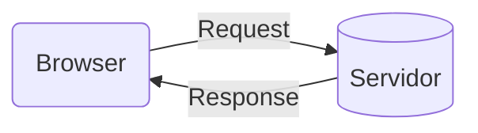
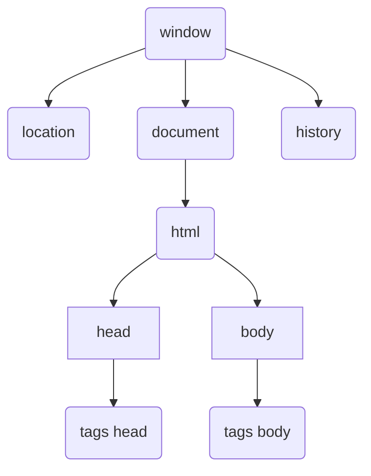

[Voltar para o início](./README.md)

# Sumário
1. [Como funciona a web](#como-funciona-a-web)
2. [HTTP](#http)
3. [HTML](#html)
4. [CSS](#css)
5. [JavaScript](#javascript)

# Como funciona a web

## HTTP
HTTP = Hypertext Transfer Protocol



---

**Pedido (request)**
+ Methods
	+ GET (Pegar um recurso)
	+ POST (Criar um recurso)

**Response (resposta)**
+ Status Code
	+ 200 - OK
	+ 301 - Redirecionamento
	+ 404 - Recurso não encontrado
	+ 500 - Erro interno de servidor

**Request/Response**
+ Header
	+ Campos informativos
	+ Propriedade: Valor
+ Body
	+ HTML
	+ Conteúdo
	+ JSON

---
## Exemplos de Request e Response

**REQUEST MESSAGE**
GET /index.html HTTP/1.1
User-Agent: Mozilla/4.0
Accept: text/html

**RESPONSE MESSAGE**
HTTP/1.1 200 OK
Server: express
Content-Type: text/html

\<html>...\</html>

# HTML
## Web Semântica
- Importante para a acessibilidade do usuário
- Motores de buscas priorizam sites semânticos

### Citações no HTML
Objetivo | Tag | Comentários
-|-|-
Espaço de citação | `<blockquote></blockquote>` |
Autor da citação | `<cite></cite>`

### Seções comuns no HTML
Objetivo | Tag | Comentários
-|-|-
Cabeçalho|`<header></header>`|Se utilizado no início da página, é visto como global; Pode ser usado dentro de um article, section etc
Barra de navegação|`<nav></nav>`| pode ser usado dentro de articles ou globalmente
Conteúdo principal|`<main></main>`|Conteúdo principal do site
Barra lateral|`<aside></aside>`| Conteúdos que possuem relação com o conteúdo principal
Rodapé|`<footer></footer>`|Normalmente no final da página

### Listas no HTML
Objetivo | Tag | Comentários
-|-|-
Definir lista ordenada|`<ol></ol>`|
Definir lista não ordenada|`<ul></ul>`|
Definir item à lista|`<li></li>`|Deve ficar dentro da tag `<ol>` ou `<ul>`

### Descrições no HTML
Objetivo | Tag | Comentários
-|-|-
Description List|`<dl></dl>`|
Description Title ou Term|`<dt></dt>`|
Description Data|`<dd></dd>`|

### Publicações e tópicos no HTML
Objetivo | Tag | Comentários
-|-|-
Artigo|`<article></article>`|Focado para conteúdos "genéricos", como publicações, receitas etc
Seção|`<section></section>`|Geralmente acompanha de um título e depois um conteúdo
Imagem|`<figure></figure>`|Usar figura por volta de uma figura, caso precise colocar autor, descrição etc
Descrição da imagem|`<figcaption></figcaption>`

### Elementos para uso genérico
- Usar esses casos apenas caso não ache um motivo semântico para parte do código/layout
- Acompanhar esses elementos com alguma Class ou Id, para gerar maior significado

Objetivo | Tag | Comentários
-|-|-
Bloco não semântico|`<div></div>`|
Texto não semântico|`<span></span>`|

## Formulário no HTML
### Form
```html
<form action="" method="">
  <fieldset>
    <legend>Contato</legend>
  </fieldset>
  <label for="nome">Nome Completo</label>
  <input id='nome' type='text'/>
  <input type="text" list="fruitsdata" placeholder="Escolha uma fruta"/>
  <datalist id="fruitsdata">
    <option>apple</option>
    <option>pineapple</option>
    <option>banana</option>
  <datalist>
  <button>Enviar</button>
</form>
```

#### Atributos Form
Objetivo | Atributo | Comentários e Valores
-|-|-
Definir um caminho que será redirecionado o form | `action=''`
Definir o método GET ou POST | `method=""`

#### Atributos Fieldset
Objetivo | Atributo | Comentários e Valores
-|-|-
Desabilitar os campos de inserção | `disabled`
Definir o fieldset à um formulário | `form="idForm"`
Atribuir um nome para identificar o fieldset | `name=""`

#### Atributos Label
Objetivo | Atributo | Comentários e Valores
-|-|-
Conectar a label com a tag de input | `for="idInput"`

#### Atributos Button
Objetivo | Atributo | Comentários e Valores
-|-|-
Definir o tipo de botão | `type=""` | reset, submit, button
Focar automaticamente o botão |`autofocus`|
Desabilitar o botão |`disabled`|útil deixar desabilitado enquanto o formulário não estiver preenchido
Identificar o botão por um nome|`name=""`|
Receber um valor de um botão|`value=""`|
Conectar o botão com o form identificado|`form="idForm"`|

### Input
#### Atributos Input
Objetivo | Atributo | Comentários e Valores
-|-|-
Definir tipo de input|`type=""`|data,text,color,number,email,file,password,...
Sugerir completar info automaticamente|`autocomplete=""`|email,data,username,...
Focar automaticamente|`autofocus`|
Desabilitar input|`disabled`|
Definir um valor inicial|`value="valor pré definido"`|
Definir texto exemplo|`placeholder="seu exemplo"`|
Ler apenas o input|`readonly`|
Linkar input com algum form|`form="idForm"`|
Definir nome do input|`name=""`|
Definir que input é necessário|`required`|


#### Atributos Input type password
Objetivo | Atributo | Comentários e Valores
-|-|-
Definir tamanho mínimo da senha |`minlength=""`|
Definir tamanho máximo da senha |`maxlength=""`|
Tamanho do campo |`size=""`|
Definir expressão Regulares |`pattern=""`|Regex
Definir info caso dê errado o input |`title="Ensira a senha de maneira X"`|
Definir tipo de input|`inputmode=""`|numeric...
Sugerir completar info automaticamente|`autocomplete=""`|on, off, new-password

#### Atributos Input type email
Objetivo | Atributo | Comentários e Valores
-|-|-
Permitir 1 ou mais emails separados por vírgulas |`multiple`|
Definir tamanho mínimo do email |`minlength=""`|
Definir tamanho máximo do email |`maxlength=""`|
Tamanho do campo |`size=""`|
Definir expressão Regulares |`pattern=""`|Regex
Definir info caso dê errado o input |`title="Ensira o email de maneira X"`|
Pegar sugestões de email de um datalist|`list="idDatalist"`|

#### Atributos Input type url
Objetivo | Atributo | Comentários e Valores
-|-|-
Definir tamanho mínimo do url|`minlength=""`|
Definir tamanho máximo do url|`maxlength=""`|
Tamanho do campo |`size=""`|
Definir expressão Regulares |`pattern=""`|Regex
Definir info caso dê errado o input |`title="Ensira o email de maneira X"`|
Pegar sugestões de url de um datalist|`list="idDatalist"`|
Habilitar verificação ortográfica|`spellcheck=""`|true,false

#### Atributos Input type file
Sintaxe
```html
<form action="" method="post" enctype="multipart/form-data">
  <input type="file">
</form>
```

Objetivo | Atributo | Comentários e Valores
-|-|-
Definir os tipos de arquivos a serem enviados|`accept=""`|.doc,audio/\*,.imagem/\*,...
Permitir envio de vários arquivos|`multiple`|
Lista de arquivo ou arquivos|`files=""`|
Valor do arquivo a ser enviado|`value=""`|

#### Atributos Input type color
Objetivo | Atributo | Comentários e Valores
-|-|-
Definir cor padrão|`value=""`|RGB
Definir lista de cores|`list="idDatalist"`|

#### Atributos Input type checkbox
Objetivo | Atributo | Comentários e Valores
-|-|-
Deixar o campo marcado como padrão|`checked`|
Atribuir um nome ao tipo de checkbox|`name=""`
Atribuir um valor ao checkbox|`value=""`

#### Atributos Input type radio
Objetivo | Atributo | Comentários e Valores
-|-|-
Deixar o campo marcado como padrão|`checked`|
Atribuir um nome ao tipo de checkbox|`name=""`
Atribuir um valor ao checkbox|`value=""`

#### Atributos Input type search
Objetivo | Atributo | Comentários e Valores
-|-|-
Definir lista de algo a ser pesquisado|`list=""`|
Definir uso de REGEX|`pattern=""`|
Usar label dentro do input|`aria-label=""`|

#### Atributos Input type number
Objetivo | Atributo | Comentários e Valores
-|-|-
Definir valor mínimo|`max=100`|
Definir valor máximo|`max=100`|
Definir procedência de um número para outro|`step="5"`|

#### Atributos Input type range
Objetivo | Atributo | Comentários e Valores
-|-|-
Definir valor mínimo|`max=100`|
Definir valor máximo|`max=100`|
Definir procedência de um número para outro|`step="5"`|

#### Atributos Input type hidden
Útil em situações que serão dados enviados "automaticamente", como IP do user, horário de envio do form etc

Objetivo | Atributo | Comentários e Valores
-|-|-
Atribuir um valor|`value=""`|

### Textarea
```html
<textarea></textarea>
```
#### Atributos Textarea
Objetivo | Atributo | Comentários e Valores
-|-|-
Definir quantidade de linhas|`rows=""`
Definir quantidade de colunas| `cols=""`
Definir tamanho mínimo do textarea|`minlength=""`|
Definir tamanho máximo do textarea|`maxlength=""`|
Embrulhar o texto |`wrap=""`|soft,hard,off

### Select
```html
<select name="carmodel">
  <option value='audi'>A3</option>
</select>
```
#### Atributos Select
Objetivo | Atributo | Comentários e Valores
-|-|-
Permitir 1 ou mais itens selecionados|`multiple`|
Tamanho do campo |`size=""`|

### Optgroup
```html
<select name="animais">
  <optgroup label="Sudeste">
    <option value='Sao Paulo'>São Paulo</option>
    <option value='Rio de Janeiro'>Rio de Janeiro</option>
  </optgroup>
  <optgroup label="Sul">
    <option value='Rio grande do Sul'>Rio grande do Sul</option>
    <option value='Paraná'>Paraná</option>
  </optgroup>
</select>
```


## Usando mídia no HTML
### Vídeo
#### Sintaxe
```html
<video src="./assets/video.mp4" controls>
  <p>Este browser não suporta vídeo, baixe-o aqui</p>
</video>

<!-- Usar a tag source para adicionar mais de uma fonte de áudio -->
<video controls>
  <source src="./assets/video.mp4" type="video/mp4">
  <source src="./assets/video2.mp4" type="video/mp4">
  <p>Este browser não suporta vídeo, baixe-o aqui</p>
</video>
```
#### Atributos
Objetivo | Atributo | Comentários
-|-|-
Origem do arquivo de vídeo|`src=""`|
Definir controles ao player de vídeo|`controls`|
Largura do Player | `width="200"` |
Altura do Player | `heigth="200"` |
Rodar automaticamente o vídeo | `autoplay` |
Carregar o vídeo antes de dar play |`preload="auto"`|auto, metadata, none
Vídeo em loop |`loop`|
Iniciar sem som |`muted`|
Thumbnail do vídeo |`poster="./imagem.png"`|

[Informações adicionais sobre mídia](https://developer.mozilla.org/pt-BR/docs/Web/Media/Formats)

---
### Áudio
#### Sintaxe
```html
<audio src="./assets/video.mp4" controls>
  <p>Este browser não suporta áudio, baixe-o aqui</p>
</audio >

<!-- Usar a tag source para adicionar mais de uma fonte de áudio -->
<audio controls>
  <source src="./assets/audio.mp3" type="audio/mp3">
  <source src="./assets/audio2.mp3" type="audio/mp3">
  <p>Este browser não suporta áudio, baixe-o aqui</p>
</audio >
```

#### Atributos
Objetivo | Atributo | Comentários
-|-|-
Origem do arquivo de vídeo|`src=""`|
Definir controles ao player de vídeo|`controls`|
Rodar automaticamente o vídeo | `autoplay` |
Carregar o áudio antes de dar play |`preload="auto"`|auto, metadata, none
Vídeo em loop |`loop`|
Iniciar sem som |`muted`|

---
### Iframe
- Funciona com vídeos do youtube, mapas do google maps e etc

#### Sintaxe
```html
<iframe
 width="560"
 height="315" 
 src="https://www.youtube-nocookie.com/embed/dQw4w9WgXcQ" 
 title="YouTube video player" 
 frameborder="0" 
 allow="accelerometer; autoplay; clipboard-write; 
 encrypted-media; gyroscope; picture-in-picture"
  allowfullscreen>
</iframe>
```

#### Atributos
Objetivo | Atributo | Comentários
-|-|-
Origem do arquivo de vídeo|`src=""`|
Definir uma borda no player |`frameborder`|
Título do player |`title=""`|
Largura do Player | `width="200"` |
Altura do Player | `heigth="200"` |
Permitir tela cheia |`allowfullscreen`|
Permitir ferramentas do site que está sendo buscado o vídeo |`allow`|

[Informações adicionais sobre Iframe](https://developer.mozilla.org/pt-BR/docs/Web/HTML/Element/iframe)

---
### Imagens
#### Sintaxe
```html

```
#### Atributos
Objetivo | Atributo | Comentários
-|-|-
Origem do arquivo | `src=""` | 
Substituir a imagem caso ela não carregue|`alt=""`
Texto que será apresentado ao deixar o mouse em cima da imagem|`title=""` |
Definir largura | `width=""` |
Definir altura | `heigth=""` |

---
### SVG
#### Sintaxe
```html
<svg heigth="400" width="400">
</svg>
```
#### Atributos
Objetivo | Atributo | Comentários
-|-|-
Definir largura | `width=""` |
Definir altura | `heigth=""` |

# CSS

## A cascata de estilização
**O estilo é sempre lido de cima para baixo**

Considera-se os 3 fatores a seguir
1. Priorização do estilo
2. Especificidade
3. Importância

---
### Priorização do estilo
inline > tag style > tag link

---
### Especificidade
É um cálculo matemático, onde, cada tipo de seletor e origem do estilo, possuem valores a serem considerados.

- Força 0 -> Universal selector(*), combinator e negation pseudo-class(:not())
- Força 1 -> Element type selector(h1) e pseudo-elements (::before, ::after)
- Força 10 -> Classes(.) e attribute selectors ([type='radio'])
- Força 100 -> ID selector (#)
- 1000 -> Inline style

---
### A regra !important
+ deve evitar seu uso
+ não é considerado uma boa prática
+ ignora a regra de priorização de estilo

## At-rules (@)

+ Definem o comportamento do CSS
+ Inicia com o sinal de '@', seguido de um identificados

### Identificadores
+ @import - Adiciona um CSS Externo
+ @media - Regras condicionais de acordo com o dispositivo
+ @font-face - Fontes externas
+ @keyframes - Animações

```css
@import url("http://local.com/style.css")

@media (min-width: 500px){
	font-size: 0.8rem;
}
```

## Shorthand
+ Junta propriedades em uma só linha
+ Resumido
+ Melhora na legibilidade

```css
	/* Sem shorthand */
	background-color: #000;
	backgroud-image: url(images/bg.gif);

	/* Com shorthand */
	background: #000 url(images/bg.gif);
```

## Vendor Prefixes

Permite que browsers adicionem "Features", a fim de colocar em uso alguma novidade que vemos no CSS

- -webkit- => Chrome, Safari, IOS e Android
- -moz- => Mozilla (Firefox)
- -ms- => Internet Explorer
- -o- => Opera

[Site para conferir as Features suportadas pelos browsers](https://caniuse.com/)

## Font-properties


Ação | Código | Comentários ou Atributos
-|-|-
Definir tipo de fonte|`font-family:Times, serif`|Especificar o nome da fonte
Definir "força" da fonte|`font-weight:bold`|valores numéricos ou string
Definir estilo da fonte|`font-style: italic`|italic, oblique, normal
Definir tamanho da fonte|`font-size: 12px`|
Definir espaços entre caracteres|`letter-spacing: 4px`|
Definir espaços entre palavras|`word-spacing: 4px`|
Definir espaços entre linhas|`line-height: 1.5`|
Transformar o texto|`text-transform: uppercase`| 
Decorar o texto|`text-decoration: line-through dashed red`|
Alinhar o texto|`text-align: center`|
Aplicar sombra no texto|`text-shadow: 1px 1px 1px black`|offset-x \| offset-y \| blur-radius \| color

```css
/* Font shorthand */
/* style variant weigth stretch size line-height family */
/* size/line-height */ 
font: italic bold 2em/2 Helvetica, Arial
```

## Unidades de medida no CSS
### Unidades comuns
Tipo | Exemplos
-|-
length (distância)|`px, em, rem, vw, vh`
angle (ângulo)|`deg, rad, turn`
time (tempo)|`s, ms`
resolution (resolução)|`dpi`

### Distâncias absolutas
> Utilizar px como preferência

Unidade | Nome | Comentários
-|-|-
`cm`|Centímetros|
`in`|Polegadas|
`px`|Pixels|

### Distâncias Relativas
> Maior adaptação aos diferentes tipos de tela

Unidade | Relativo à | Comentários
-|-|-
`em`|Tamanho da font do pai|
`rem`|Tamanho da font do elemento raiz (root/html)|
`vw`|1% da viewport width (largura)|
`vh`|1% da viewport height (altura)|
`%`|Valor do pai|

## Selectors e Combinators
### Seletor de Atributo
```css
[atributeName] {
  color: orange;
}
```

### Seletor de vários elementos
```css
[atributeName], h1, .text, #nav-bar {
  color: orange;
}
```

### Combinators
Combinator | Sintaxe | Comentários
-|-|-
Descendant Combinator | `body article h2` | Busca um elemento dentro de outro
Child Combinator | `body > ul > li` | Seleciona somente o elemento que é filho direto do pai
Adjacent Sibling Combinator |`h1 + p`|Seleciona somente o elemento do lado direito que é irmão direto na hierarquia
General Sibling Combinator |`h1 ~ p`|Seleciona todos os elementos irmãos

### Pseudo-classes
É um tipo de selector que irá selecionar um elemento que estiver em um estado específico.

Pseudo-classes começam com 2 pontos seguido do nome da pseudo class `:pseudo-class-name`

Pseudo-classes | Sintaxe | Comentários
-|-|-
Primeiro filho | `:first-child` |
Enésimo filho | `:nth-child(2)` | Pode preencher com *odd* e *even*
Enésimo elemento | `article p:nth-of-type(2){}` |
Mouse por cima do elemento |`:hover`|
Ao receber foco |`:focus`|
Quando desabilitado |`:disabled`|
Quando obrigatório |`:required`|

[Mais informações sobre Pseudo-classes](https://developer.mozilla.org/pt-BR/docs/Web/CSS/Pseudo-classes)

### Pseudo-elements
Pseudo-classes | Sintaxe | Comentários
-|-|-
Aparecer antes do conteúdo | `::before` |
Aparecer depois do conteúdo | `::after` |
Aparecer na primeira linha do elemento| `::first-line` |

[Mais informações sobre Pseudo-elements](https://developer.mozilla.org/pt-BR/docs/Web/CSS/Pseudo-elements)

## Box Model
- Fundamental para fazer layout para a web
- Maior facilidade para aplicar o CSS

**Propriedades de um Box Model**

### box-sizing
content-box | border-box
-|-
O tamanho da "caixa" é baseada a partir do elemento, não respeitando a largura e a altura definida no código | O tamanho da "caixa" é feito a partir das proporções definidas, respeitando sempre seu tamanho, independente do conteúdo

### display
block | inline
-|-
Ocupa toda a linha, colocando o próximo elemento abaixo desse|Elemento ao lado do outro
width e height são respeitado|width e height não funcionam
padding, margin, border irão funcionar normalmente|somente valores horizontais de margin, padding e border

## Cores
### Tipos
- background-color (para caixas)
- color (para textos)
- border-color (para caixas)

### Valores
- palavra-chave (blue, red, transparent)
- hexadecimal (#990011)
- funções: rgb(), rgba(), hsl(), hsla()

[Mais informações sobre cores](https://developer.mozilla.org/pt-BR/docs/Web/CSS/color_value)

## Background

[Mais informações sobre Background](https://developer.mozilla.org/en-US/docs/Web/CSS/background)

## Page Layouts
### Grid
- Posicionamento dos elementos dentro da caixa
- Posicionamento horizontal e vertical ao mesmo temo
- Pode ser flexível ou fixo
- Cria espaços para os elementos filhos habitarem

#### Sintaxe CSS do Grid
Ação | Comando | Comentários
-|-|-
Definir as áreas do grid no elemento pai | `grid-template-areas: "header header" "main aside" "footer footer"` | Cada \"aspas\" é uma linha (row)
Atribuir elemento filho ao grid | `grid-area: header`
Definir tamanho da linha de um grid | `grid-template-rows: 40px 1fr 40px`
Definir tamanho da coluna de um grid | `grid-template-columns: 2fr 1fr`

### Flexbox
- Permite posicionar os elementos dentro da caixa
- Controle em uma dimensão (horizontal ou vertical)
- Alinhamento, direcionamento, ordenar e tamanhos

#### flex-direction 
Direção do conteúdo | Atributo | Comment
-|-|-
Esquerda para direita|`flex-direction: row;`|valor padrão
Cima para baixo|`flex-direction: column;`|
Direita para esquerda|`flex-direction: row-reverse;`
Baixo para cima|`flex-direction: column-reverse;`|

#### justify-content
- Baseia-se no eixo principal do flexbox

Alinhar o conteúdo | Atributo | Comment
-|-|-
Para o começo do container |`justify-content: flex-start;`|valor padrão
Para o fim do container|`justify-content: flex-end;`|
Para o centro do container|`justify-content: center;`|
Com espaço entre os itens, encostando na borda|`justify-content: space-between;`
Com espaço igual entre os itens, mas diferente com a borda|`justify-content: space-around;`
Com espaço igual entre os itens e a borda|`justify-content: space-evenly;`

#### align-items
- Baseia-se no eixo oposto do flexbox

Alinhar o conteúdo | Atributo | Comment
-|-|-
Para o começo do container |`align-items: flex-start;`|valor padrão
Para o fim do container|`align-items: flex-end;`|
Para o centro do container|`align-items: center;`|
Centralizando os itens no começo do container|`align-items: baseline;`|
Esticando os itens para o conteúdo do container|`align-items: stretch;`|

#### align-self
- Ajustar o alinhamento de um único elemento

Alinhar o conteúdo | Atributo | Comment
-|-|-
Para o começo do container |`align-self: flex-start;`|valor padrão
Para o fim do container|`align-self: flex-end;`|
Para o centro do container|`align-self: center;`|
Centralizando os itens no começo do container|`align-self: baseline;`|
Esticando os itens para o conteúdo do container|`align-self: stretch;`|

#### flex-wrap
- Alterar a quantidade de linhas que o conteúdo será apresentado

Manter os itens do conteúdo | Atributo | Comment
-|-|-
Na mesma linha|`flex-wrap: nowrap;`|valor padrão
Em outras linhas|`flex-wrap: wrap;`|
Em outras linhas só que no sentido contrário|`flex-wrap: wrap-reverse;`

#### flex-flow
- Shorthand para o uso de `flex-direction` e `flex-flow`

#### align-content
- Usado para alinhar itens em múltiplas linhas do eixo oposto do flex-container
- Não terá efeito em conteúdo com uma linha

Alinhar o conteúdo | Atributo | Comment
-|-|-
Para o começo do container |`align-content: flex-start;`|valor padrão
Para o fim do container|`align-content: flex-end;`|
Para o centro do container|`align-content: center;`|
Com espaço entre os itens, encostando na borda|`align-content: space-between;`
Com espaço entre os itens, sem encostar na borda|`align-content: space-around;`
Esticando os itens para o conteúdo do container|`align-content: stretch;`|

### Propriedades dos itens
- **Sempre** referente ao eixo main do item

Definir | Atributo| Comment
-|-|-
Largura ou altura|`flex-basis: 50px;`|
Aumentar o tamanho do item|`flex-grow: 1;`|Proporção, como se fosse o `1fr` do grid
Encolher o tamanho do item|`flex-shrink: 1`|Proporção, como se fosse o `1fr` do grid, por padrão vem 1

#### flex shorthand
`flex: flex-grow flex-shrink flex-basis`;

[Mais informações sobre Page Layout](https://developer.mozilla.org/pt-BR/docs/Learn/CSS/CSS_layout)

[Mais informações sobre Flexbox](https://www.freecodecamp.org/news/flexbox-the-ultimate-css-flex-cheatsheet/)

# JavaScript

## JavaScript Core
+ Linguagem de programação que roda no Navegador do usuário (front end)
	+ Se você clicar em algum botão da página e aparece uma janela. Isso é JavaScript
	+ Alteração do site ou aplicativo, conforme a interação do User
+ Roda também no computador (back-end)

## Onde pode ser utilizado?
+ Usa-se para criar aplicações web, mobile (React Native) e desktop (Electron)
+ Maioria dos sustes usam JavaScript
+ Linguagem obrigatório para Front End Web

## Variáveis do JavaScript

### Tipos de variáveis
+ number (4, 8.5)
	+ Infinity
	+ NaN
+ string ('Exemplo')
+ boolean (true false)
+ null
+ undefined
+ Symbol
+ object
	+ Array
+ function

Descobrir o tipo de uma variável, usar o comando:
```javascript
typeof "Olá Mundo!"
```
Ele retorna `'string'`

## Manipulação de Dados

### Converter um tipo para outro
Objetivo | Comando | Comentário/Output
-|-|-
Converter para String | `String(20)`
Converter para String | `20.toString()`
Converter para Int | `Number.parseInt(n)`
Converter para Float | `Number.parseFloat(n)`
Converter para Número | `Number('2.2')`

---
### Manipulando String
Objetivo | Comando | Comentário/Output
-|-|-
Saber tamanho de uma String | `string.length`|
Quebrar a String por um delimitador, transforma em array | `string.split('x')`|
Substituir um valor por outro|`string.replace('nome1','nome2')`|Aceita RegEx
Pegar o último caractere de um valor|`string.slice(-1)`|
Retornar um valor exceto a última letra|`string.slice(0,-1)`|
Retornar um valor a partir da segunda letra|`string.slice(1)`|
Retornar uma quantidade n de valores a partir de uma posição|`string.substr(0,3)`|

---
### Manipulando Number
Objetivo | Comando | Comentário/Output
-|-|-
Define quantidade de casas decimais | `number.toFixed(2)`|

---
### Manipulando variáveis compostas (Arrays)
Objetivo | Comando | Comentário/Output
-|-|-
Retornar tamanho do Array|`people.length`|
Verificar se é um Array|`Array.isArray(people)`|
Iterar itens do Array|`people.forEach((value, index, array) => value)`|
Criar um Array|`let nomeArray = []`|
Criar um Array|`let nomeArray = nomeArray.Array()`|
Criar um Array a partir de um array-like ou iterable object|`let nomeArray = nomeArray2.Array()`|
Adicionar valores no final de um Array|`nomeArray.push(2)`| retorna o tamanho do array
Remover valores do final de um Array|`nomeArray.pop()`| retorna o item removido
Adicionar valores no início de um Array|`nomeArray.unshift(1)`| retorna o tamanho do array
Remover valores do início de um Array|`nomeArray.shift()`| retorna o item removido
Ordenar valores de um Array contendo String|`nomeArray.sort()`|
Ordenar valores de um Array contendo number|`arr.sort((a,b)  => a-b)`|
Concatenar arrays|`array1.concat(array2)`|
Pegar uma parte do array|`array.slice(0,2)`|
Inserir e remover elementos|`array.splice(0,0,"first")`|arr.splice(pos, qtdRemover, valor)
Conferir se um elemento existe|`arr.includes(2)`|
Conferir se um item do Array corresponde à uma condição|`arr.some(value => value % 2 === 0)`|
Conferir se todos os itens do Array correspondem à uma condição|`arr.some(value => value % 2 === 0)`|
Inverter o sentido de um Array|`arr.reverse()`|
Transformar o array em outro tipo de dado|`arr.join('-')`
Procurar por um valor dentro de um Array|`nomeArray.indexOf(valorDesejado)`|caso o valor não exista, será retornado -1
Procurar por um primeiro valor |`arr.find(value => value > 2)`|
Procurar pelo primeiro índice de um valor |`arr.findIndex(value => value > 2)`|
Retornar os índices do array|`arr.keys()`|
Retornar os valores das chaves um objeto|`arr.values()`|
Retornar um array de arrays contendo nome_prop e valor_prop|`arr.entries()`|

### Percorrer elementos de um Array (map)
```js
const arr = [1,2,3,4,5]

arr.map(value => value * 2)
console.log(newArr)
// [2,4,6,8,10]
```
### Filtrar elementos de um Array (filter)
```js
const arr = [1,2,3,4,5]
const allValuesGreaterThanTwo = arr.filter(value => value > 2)

console.log(allValuesGreaterThanTwo)
// [3,4,5]
```

### Transformar um Array em outro tipo de dado (reduce)
```js
const arr = [1,2,3,4,5]

arr.reduce((acumulado, value) => acumulado += value, 0)
// acumulado => o que será retornado
// , 0 => o tipo da variável, no caso, inicia seu valor em 0
// 15
```

### flat & flatMap
```js
// flat
const arr = [1,2,[3,4]]
let depth = 1

let newArr = arr.flat(depth)
console.log(newArr)
// [1,2,3,4]
```

```js
const arr = [1,2,3,4]

arr.flatMap(value => [value*2])
// [2,4,6,8]

arr.flatMap(value => [[value*2]])
// [[2],[4],[6],[8]]
```

---
### Manipulando Object
```js
let user = {
  name: 'Diego',
  age: 21,
}

const person = {
  name: 'Gustavo'
}
```
Objetivo | Comando | Comentário/Output
-|-|-
Alterar a propriedade de um objeto|`user.name = 'Outro nome 1'`|
Alterar a propriedade de um objeto|`user['name'] = 'Outro nome 2'`|
Criar uma propriedade|`user.lastName = 'Braga'`|
Deletar uma propriedade|`delete user.lastName`|
Retornar as chaves do objeto|`Object.keys(user)`| ['name', 'age']
Retornar os valores das chaves um objeto|`Objetct.values(user)`| ['Diego', 21]
Retornar um array de arrays contendo nome_prop e valor_prop|`Object.entries(user)`| [['name','Diego'],['age',21]]
Fazer Merge das propriedade de um objeto|`Object.assign({}, user, {fullName: 'Diego Braga'})`|
Prevenir alterações no Objeto|`Object.freeze(user)`|
Permitir alterar apenas propriedades existentes de um objeto|`Object.seal(person)`|

### Input e Output
```javascript
// APRESENTA UM 'POP-UP' COM A MENSAGEM
window.alert('Minha primeira mensagem')
 
// APRESENTA DUAS OPÇÕES PARA O USER ESCOLHER
window.confirm('Está gostando de JS?') 

// APRESENTAR UM INPUT PARA INSERIR ALGUM DADO
window.prompt('Qual é o seu nome?') 
```

### Definindo um valor no formato de alguma moeda
```javascript
let salario = 1554

salarioReais = salario.toLocaleString('pt-BR', {style: 'currency', currency: 'BRL'})

salarioDolar = salario.toLocaleString('pt-BR', {style: 'currency', currency: 'USD'})

salarioEuros = salario.toLocaleString('pt-BR', {style: 'currency', currency: 'EUR'})

console.log(salarioReais)
console.log(salarioDolar)
console.log(salarioEuros)
```
OUTPUT: 
`R$ 1.554,50`
`US$ 1.554,50`
`€ 1.554,50`

### Template String
```javascript
let nome = 'Diego'
console.log(`O nome é ${nome}`)
```

## Lidando com erros

### throw e try...catch
```js
function checkName(name = '') {
  if (name === '') {
    throw new Error('Name is empty! Please insert a proper name')
  }
  // caso dê erro, ele para de executar a função
  console.log(name)
}

try {
  checkName()
} catch (e) {
  console.log(e) // 'Name is empty! Please insert a proper name'
}
```

## Operadores do JavaScript
### Aritméticos
+ \+ soma
+ \- subtração
+ \* multiplicação
+ \/ divisão
+ \% resto da divisão inteira
+ \** exponenciação

### Atribuição
+ = atribuição simples
+ auto-atribuição 
	+ n = n + 4
	+ n = n - 1
	+ n += 4
	+ n -= 1
	+ etc
+ incremento
	+ x++
+ decremento
	+ x\-\-

### Relacionais (resultado bool)
+ \> maior
+ \< menor
+ \>= maior ou igual
+ \<= menor ou igual
+ == igual a
+ === igualdade restrita (mesmo tipo e valor)
+ != diferente de
+ !== desigual restrito

### Lógicos (prioridade: and -> not -> or)
+ ! not (negação) 
+ && and (conjunção)
+ || or (disjunção)

### Ternário
+ teste ? true : false
  
### Falsy
> Quando um valor é considerado false em contextos que um boolean é obrigatório

+ false
+ 0
+ -0
+ ""
+ null
+ undefined
+ NaN

### Truthy
> Quando um valor é considerado true em contextos que um boolean é obrigatório

+ true
+ {}
+ []
+ 1
+ 3.23
+ "0"
+ "false"
+ -1
+ Infinity
+ -Infinity

### Rest operator
- Serve para receber N parâmetros, sendo do tipo Array
```js
const sum = (...rest) {
  return rest.reduce((acc, value) => acc + value, 0)
}

console.log(sum(1,2,3,4))
// 10
```

### Spread operator
- Serve para distribuir N parâmetros para uma função
- Pode receber
	- Strings
	- Arrays
	- Objetos literais-
	- Objetos iteraveis
```js
const multiply = (...args) => args.reduce((acc, value) => acc * value, 1)

const sum = (...rest) => {
  return multiply(...rest)
}

console.log(sum(1,2,3,4))
// 10
```

### Destructing Assignment
```js
// Array
let [apple, banana, orange] = ["Apple", "Banana", "Orange"]

// Object
let obj = {
  name: 'Diego'
}

// colocar o mesmo nome da propriedade
let { name } = obj

// caso queira atribuir a outro nome, colocar ":" + "nomeVar"
let { name : newName } = obj

// Function
// Aceita default values
function sum([a, b] = [0, 0]) {
  return a + b
}

console.log(sum(2))
```

### Symbols e Iterators
- Symbol: gerar um identificador **único**
- Well known Symbols
	- iterator
	- split
	- toString Tag

```js
// Symbol Iterator
// Percorre um array, String ou objeto, ele retornar dois valores, VALUE e DONE
// VALUE == valor inteiro
// DONE == boolean
// É possível associar com o for...of
const arr = [1,2,3,4]

const it = arr[Symbol.iterator]()

while(true){
  const [value, done] = it.next()

  if(done){
    break
  }

  console.log(value)
}
```

Usando Symbol.interator em um objeto
```js
const obj = {
  value: [1,2,3,4],
  [Symbol.iterator]() {
    let id = 0

    return {
      next: () => {
        return {
          i++
          value: this.values[i - 1],
          done: i > this.values.length
	}
      }
    }
  }
}

const it = obj[Symbol.iterator]()
```

[Mais informações sobre iterator](https://developer.mozilla.org/pt-BR/docs/Web/JavaScript/Reference/Iteration_protocols)

### Generators
- são funções com pausas e retornam valores
- a palavra ***yield*** indica a pausa dentro da função
	- para dar continuidade bastar usar o método next()

```js
function* hello(){
  // Yield retorna dois valores, VALUE e DONE
  // VALUE == valor inteiro
  // DONE == boolean

  console.log('Hello')
  // adicionando um valor na interação
  yield 1
  
  console.log('Hello')
  const value = yield
  
  console.log(value)
}

const it = hello()

console.log(it.next())
console.log(it.next())
console.log(it.next('Outside!'))
```

[Saiba mais sobre Generator](https://developer.mozilla.org/pt-BR/docs/Web/JavaScript/Reference/Global_Objects/Generator)

## Condições

#### Condição Simples
```javascript
if(condicao == true){
  console.log(`Positivo`)
} 
```

#### Condição Composta
```javascript
if(condicao == true){
  console.log(`Positivo`)
} else {
  console.log(`Negativo`)
}
```

#### Condição Múltipla
```javascript
switch(expressão){
  case valor1:
    break
  case valor2:
    break
  case valor3:
    break
  default:
    break
}
```

## Repetições

### While
```javascript
// TESTE LÓGICO NO INÍCIO
while (true){
  funcao()
}
```

### Do...While
```javascript
// TESTE LÓGICO NO FINAL
do {
  funcao()
} while (condição)
```

### For
```javascript
for(let i = 0; i < 5; i++){
  console.log(`index [${i}]`)
}
```

### For...in
- Pega as propriedades de um objeto
- Pega o index de um Array

```javascript
let  person = {
  name: 'João',
  age: 20,
  weight: 88.6
}

for(let property in person){
  console.log(`A propriedade do objeto é ${property} `)
  console.log(`e seu valor é ${person[property]}`)
}
```

### For...of
- Pegar os valores de um array ou objeto

```javascript
let  nomeArray  = ['João','Paulo','Pedro']

for(let name of nomeArray){
  console.log(`${name} `)
}
```

## Funções
> - São **ações** executadas assim que **chamadas** ou em decorrência de algum **evento**.
> - Uma **função** pode receber **parâmetros** e retornar um **resultado**.

```javascript
// DEFININDO UM VALOR DO PARÂMETRO CASO NÃO À PASSE
function soma(n1=0, n2=0){
  return n1 + n2
}

console.log(soma(1))
// JÁ QUE NÃO FOI ATRIBUÍDO UM SEGUNDO PARÂMETRO, SEU VALOR SERÁ ZERO
```

### Arrow Function
Arrow Function com return implícito
```javascript
const arrowFn0 = () => 'seu return aqui'
```

Arrow Function sem return implícito
```javascript
const arrowFn = () => {
  // expressão qualquer
  return 'seu return aqui'
}
```

### Callbacks e Promises
> Um Callback é uma função passada como um argumento para outra função.

Promises
- 3 estados
	- Pending (em execução)
	- Fulfilled (executou sem erros)
	- Rejected (apresentou algum erro) 
```js
const myPromise = new Promise((resolve, reject) => {
  resolve('Your Promise is Fulfilled!')
})
```

Ação|Atributos
-|-
Retorna as Promises ao mesmo Tempo|`Promise.all([Promise1(),Promise2()])` 
Retorna a Promise que terminar primeiro|`Promise.race([Promise1(),Promise2()])`

[Saiba mais sobre callbacks](https://www.w3schools.com/js/js_callback.asp)

[Saiba mais sobre Promises](https://developer.mozilla.org/pt-BR/docs/Web/JavaScript/Guide/Using_promises)

### Fetch
```js
// Fetch aceita um segundo parâmentro, onde será identificado o método e o header
// Por padrão, o Fetch vem com o método GET
fetch('/data.json')
  .then(responseStream => {
    if(responseStream === 200){
      return responseStream.json()
    } else {
      throw new Error('Request error')
    }
  })
  .then(data => {
    console.log(data)
  })
  .catch(err => {
    console.log('Error: ', err)
  })
// fetch só dará erro caso seja erro de Rede
```

[Saiba mais sobre Fetch](https://www.w3schools.com/js/js_api_fetch.asp)

### Async/Await
- Async transforma uma função em uma promise
	- Consequentemente permite usar .then e .catch
- Await espera que outras Promises sejam resolvidas
```js
const asyncTimer = new Promise(resolve, reject) => {
  setTimeout(() => {
    resolve(12345)
  }, 1000)
}

const simpleFunction = async () => {
  const data = await asyncTimer()
  return data
}

simpleFunction()
  .then(data => {
    console.log(data)
  })
  .catch(err => {
    console.log(`Error: ${err}`)
  })
```

[Saiba mais sobre Async/Await](https://www.w3schools.com/js/js_async.asp)

### Event Emitter
- Exclusivo do NODE

```js
const EventEmitter = require('events')

const emitter = new EventEmitter()

emitter.on('User logged', data => {
  console.log(data)
})

emmiter.emit('User logged', {user: 'Diego Braga'})
```

## Testes
### TDD (Test Driven Development)
Consiste em desenvolver o teste antes do código ser criado, testando e refatorando em pequenos ciclos

#### Etapas
- Escrita do Teste
- Escrita do Código
- Refatoração

#### Vantagens
- Feedback rápido
- Maior segurança em alteração e novas funcionalidades
- Código mais limpo
- Produtividade

### BDD (Behavior Driven Development)
Juntar regra de negócio com linguagem de programação

#### Pilares
- Testes
- Documentação
- Exemplos

#### Vantagens
- Compartilhamento de conhecimento
- Documentação dinâmica
- Visão do todo

### Ferramentas de Teste
#### Mocha
1. Instalar a dependência como desenvolvedor
```bash
npm install --save-dev mocha
```
2. Alterar o arquivo `package.json`, onde será alterado a parte de `scripts` para `"test": "moca"`
3. Criar um diretório `Teste` onde serão colocados os arquivos de teste, seguindo o padrão `fileName.spec.js`

Exemplo de Código
```js
const assert = require("assert")
const Math = require("../src/math.js")

let value = 0 

// describe -> descrever para que é o teste
describe("Math Class", function(){
  // hook
  beforeEach(function(){
    value = 0 
  })

  // recomenda-se o uso de function() para poder utilizar this.
  // it -> resultado esperado do teste, como se fosse um passo
  it('Sum two numbers', function(){
    const math = new Math()
    value = 5
    assert.equal(math.sum(value ,5), 10)
  }
  // it.only -> serve para executar apenas aquele teste
  // it.skip -> serve para pular o teste especificado
  it.only('Multiply two numbers', function(){
    const math = new Math()
    // aqui value será 0, por causa do hook
    assert.equal(math.multiply(value,5),0)
  })
})
```

[Saber mais sobre o Mocha](https://mochajs.org/)

#### Chai
Serve para substituir o "assert" do node, agora sendo mais descritiva

1. Instalar a biblioteca como desenvolvedor
```bash
npm install --save-dev chai
```

Exemplo de Código
```js
const assert = require("assert")
const Math = require("../src/math.js")

// importando a lib Chai
const expect = require('chai').expect

let value = 0 

// describe -> descrever para que é o teste
describe("Math Class", function(){
  // hook
  beforeEach(function(){
    value = 0 
  })

  // recomenda-se o uso de function() para poder utilizar this.
  // it -> resultado esperado do teste, como se fosse um passo
  it('Sum two numbers', function(){
    const math = new Math()
    value = 5
    expect(math.sum(value,5)).to.equal.(10)
  }
  // it.only -> serve para executar apenas aquele teste
  // it.skip -> serve para pular o teste especificado
  it('Multiply two numbers', function(){
    const math = new Math()
    const obj = {
      name: 'Diego Braga' 
    }

    const obj2 = {
      name: 'Diego Braga' 
    }

    // validar um objeto
    expect(obj).to.have.property('name').equal('Diego Braga')
    // valida se os objetos possuem as mesmas caracterísiticas
    expect(obj).to.deep.equal(obj2)

    // aqui value será 0, por causa do hook
    expect(math.multiply(value,5)).to.equal(0)
  })
})
```

[Saber mais sobre o chai](https://www.chaijs.com/)

#### Sinon
Serve para observar se as funções foram invocadas

1. Instalar a biblioteca como desenvolvedor
```bash
npm install --save-dev sinon
```

Exemplo de Código
```js
const assert = require("assert")
const Math = require("../src/math.js")

// importando a lib Chai
const expect = require('chai').expect

// importando a lib Sinon
const expect = require('sinon')

let value = 0 

// describe -> descrever para que é o teste
describe("Math Class", function(){
  // hook
  beforeEach(function(){
    value = 0 
  })

  // recomenda-se o uso de function() para poder utilizar this.
  // it -> resultado esperado do teste, como se fosse um passo
  it('Sum two numbers', function(){
    const math = new Math()
    value = 5
    expect(math.sum(value,5)).to.equal.(10)
  }
  // it.only -> serve para executar apenas aquele teste
  // it.skip -> serve para pular o teste especificado
  it('Multiply two numbers', function(){
    const math = new Math()
    const obj = {
      name: 'Diego Braga' 
    }
    
    const obj2 = {
      name: 'Diego Braga' 
    }

    // validar um objeto
    expect(obj).to.have.property('name').equal('Diego Braga')
    // valida se os objetos possuem as mesmas caracterísiticas
    expect(obj).to.deep.equal(obj2)

    // aqui value será 0, por causa do hook
    expect(math.multiply(value,5)).to.equal(0)
  })

  it.only('Call req with sum and index values',function(){
    const req = {}
    const res = {
      load: sinon.spy()
    }
    const math = new Math()
    
    math.printSum(req,res,5,5)

    expect(res.load.calledOnce).to.be.true
    
  })

})
```

[Saber mais sobre Sinon](https://sinonjs.org/)

### Debugging

#### Console

Ação | Comando | Comentário
-|-|-
Apresentar uma mensagem|`console.log('Texto preto')`|
Apresentar uma mensagem com sinal de alerta|`console.warn('Texto amarelo com sinal de alerta')`|
Apresentar uma mensagem com sinal de erro|`console.error('Texto vermelho com sinal de erro')`|
Indicar de onde o código está sendo executado |`console.trace()`|
Iniciar agrupamento de um número N de mensagens |`console.group('Group Name')`|
Finalizar agrupamento de um número N de mensagens |`console.groupEnd('Group Name')`|
Iniciar contagem do tempo de execução|console.time('Timer name')|
Finalizar contagem do tempo de execução|console.timeEnd('Timer name')|
Gerar tabela de dados no console|console.table(['Digital Innovation', 'Diego Braga']
Retornar uma mensagem do console caso uma condição seja falsa|`console.assert(1 === 2, 'Error')`
Estilizar o console|`console.log('%c log estilizado', 'color: green; font-size? 20px')`

## DOM (Document Object Model)

### Árvore DOM

---

### Selecionando elemento
#### Por Marca
```javascript
window.document.getElementsByTagName('p')[0]
//[index] serve para selecionar o elemento específico, começa em 0
// Retorna um HTMLCollection
```

#### Por ID
```javascript
window.document.getElementById('textoMateria')
// Retorna um elemento
```

#### Por Nome
```javascript
window.document.getElementsByName('nomee')[0]
// [index] serve para selecionar o elemento específico, começa em 0
// Retorna um HTMLCollection
```

#### Por Classe
```javascript
window.document.getElementsByClassName('materia')[0]
// [index] serve para selecionar o elemento específico, começa em 0, é opcional
// Retorna um HTMLCollection
```

#### Por Seletor
```javascript
window.document.querySelector('p#textoMateria')
// Retorna um elemento

window.document.querySelectorAll()
// [index] serve para selecionar o elemento específico, começa em 0, é opcional
// Retorna um nodeList
```
---

### Estilizando via JavaScript
Style
```javascript
// o estilo é como se fosse inline style
document.getElementById("p2").style.color = "blue";
```

ClassList
```javascript
element.classList.add('darkmode')
element.classList.remove('darkmode')
element.classList.toggle('darkmode')
``` 

---
### Eventos DOM
```javascript
let  idArea = document.getElementById('area')
{/* <div id="area" onmousedown="trocarBackground()" 
onmouseout='voltarBackground()'>
	Interaja...
</div> */}

// PARA DEIXAR A DIV MAIS ORGANIZADA, VALE A PENA USAR EVENT LISTENER
// EVENTO DO MOUSE AO PRESSIONAR O ELEMENTO
idArea.addEventListener('mousedown', trocarBackground())

// EVENTO DO MOUSE AO SAIR DO ELEMENTO
idArea.addEventListener('mouseout', voltarBackground())
```

Para saber todos os eventos, clique [aqui](https://developer.mozilla.org/pt-BR/docs/Web/Events)

### Adicionando elementos à DOM
```javascript
let elemResField = document.querySelector('#resField')

let img = document.createElement('img')

img.src = "https://images.unsplash.com/photo-1571243863567-fb012e468631?ixid=MnwxMjA3fDB8MHxwaG90by1wYWdlfHx8fGVufDB8fHx8&ixlib=rb-1.2.1&auto=format&fit=crop&w=675&q=80"

elemResField.appendChild(img)
```

Objetivo|Código
-|-
Adicionar elemento|`elemResField.append(img)`
Adicionar elemento como primeiro filho|`elemResField.prepend(img)`
Adicionar antes de um elemento|`elemResField.insertBefore(divAdd, divReferencia)`

### Adicionar elementos ao HTML
```javascript
document.write(`Linha adicionada via javascript<br/>`)
// É POSSÍVEL ADICIONAR TAGS HTML

document.write(`<h2>Escrevi um Cabeçalho de nível 2</h2>`
```

### Removendo elementos da DOM
```javascript
// PRECISA QUE O ELEMENTO EM QUESTÃO JÁ EXISTA PARA REMOVÊLO
resField.removeChild(document.querySelector('#resField p'))

// ZERA O ELEMENTO, DIV OU CLASSE
resField.innerHTML  =  ``
```

### Manipular Conteúdo
```js
// considere as constantes abaixo para a tabela
const elementList = document.querySelector('#lista')
const elementLogin = document.querySelector('#login')
const elementHeader = document.querySelector('header')
```

Objetivo|Código
-|-
Manipular conteúdo do texto|`elementList.textContent = 'Olá lista'`
Manipular texto|`elementList.innerText = 'Olá lista'`
Manipular HTML|`elementList.innerHTML = '<h1>Olá lista</h1>'`
Manipular valor|`elementLogin.value = 'Valor desejado'`
Manipular atributo|`elementHeader.setAttribute('id', 'cabecalho')`
Pegar atributo|`elementHeader.getAttribute('id')`
Remover atributo|`elementHeader.removeAttribute('id')`

### Navegar pelos elementos
```js
// considere as constantes abaixo para a tabela
const body = document.querySelector('body')
const header = document.querySelector('header')
```

Objetivo|Código|Comentários
-|-|-
Buscar elemento pai|`body.parentNode`|
Buscar elemento pai|`body.parentElement`|
Buscar elementos filho|`body.childNodes`|Considera os espaços vazios
Buscar elementos filho|`body.children`|Desconsidera os espaços vazios
Buscar primeiro filho|`body.firstElementChild`|Desconsidera os espaços vazios
Buscar primeiro filho|`body.firstChild`|Considera os espaços vazios
Buscar último filho|`body.lastElementChild`|Desconsidera os espaços vazios
Buscar último filho|`body.lastChild`|Considera os espaços vazios
Buscar próximo irmão|`header.nextSibling`|Considera os espaços vazios
Buscar próximo irmão|`header.nextElementSibling`|Desconsidera os espaços vazios
Buscar irmão anterior|`header.previousSibling`|Considera os espaços vazios
Buscar irmão anterior|`header.previousElementSibling`|Desconsidera os espaços vazios


